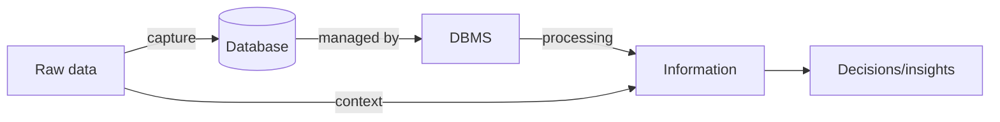

# Lec-01: Introduction to DBMS

## Quick Highlights
- Data vs information with examples; information is processed data used for decisions.
- Databases organize data for easy access, updates, and management; DBMS is the software layer.
- DBMS solves file-system pain: redundancy, inconsistency, isolation, integrity, atomicity, concurrency, security.
- Data measured in bits/bytes; qualitative vs quantitative forms.

## Diagram


## Full Notes
Use the highlights for a quick scan; expand below for the verbatim PDF text.
<details>
<summary>Show raw lecture notes</summary>

```text
1. What is Data?
a. Data is a collection of raw, unorganized facts and details such as text, observations, figures, symbols, and descriptions.
b. By itself, data has no specific purpose or meaning; it becomes useful only when processed.
c. Data is measured in bits and bytes — the basic units of information in computer storage and processing.

2. Types of Data
a. Quantitative
  i. Numerical form.
  ii. Examples: weight, volume, cost.
b. Qualitative
  i. Descriptive (not numerical).
  ii. Examples: name, gender, hair color.

3. What is Information?
a. Information is processed, organized, and structured data.
b. It provides context and enables decision making.
c. Information is the result of analyzing and interpreting data.
d. Example: From a dataset of all people in a locality, you can derive:
  i. There are 100 senior citizens.
  ii. The sex ratio is 1.1.
  iii. There are 100 newborn babies.
  These derived facts are information.

4. Data vs Information
a. Data are raw facts; information puts those facts into context.
b. Data is unorganized; information is organized.
c. Data points can be isolated; information shows how they fit together.
d. Data alone is meaningless; when analyzed it becomes information.
e. Information depends on data; data does not depend on information.
f. Data often appears as numbers, graphs, or statistics; information is expressed through words, ideas, and insights.
g. Data alone is usually insufficient for decision-making; information supports decisions.

5. What is a Database?
a. A database is an electronic system where data is stored so it can be easily accessed, managed, and updated.
b. To make data usable, we need a Database Management System (DBMS).

6. What is a DBMS?
a. A Database Management System (DBMS) is software that manages a collection of interrelated data and provides programs to access that data.
b. The database is the organized collection of data relevant to an enterprise; the DBMS provides a convenient and efficient way to store and retrieve that data.
c. A DBMS supports operations such as insertion, retrieval, update, and deletion.

7. (Reserved / optional section)

8. DBMS vs File Systems
a. Traditional file-processing systems have major disadvantages:
  i. Data redundancy and inconsistency
  ii. Difficulty in accessing data
  iii. Data isolation
  iv. Integrity problems
  v. Atomicity problems
  vi. Concurrency (concurrent-access) anomalies
  vii. Security problems
b. Addressing the above problems is one of the primary advantages of using a DBMS.
```

</details>

## Interview Q&A
- **Q:** Differentiate data vs information with a real example you have seen in production systems.
  **A:** Data are raw observations (e.g., clickstream logs), information is processed data that informs action (e.g., session conversion rate derived from those logs).
- **Q:** Why do teams move from file-based storage to a DBMS as scale grows?
  **A:** To reduce redundancy/inconsistency, enforce integrity/security, support concurrency control, indexing, backups, and standardized access through a query language.
- **Q:** Name two ways to improve data quality at ingestion time.
  **A:** Validate schemas/types at the edge, normalize controlled vocabularies, reject duplicates with keys, and add metadata (timestamps/source) for traceability.
