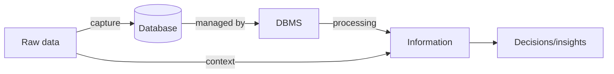

# Lec-01: Introduction to DBMS

## Quick Highlights
- Data vs information with examples; information is processed data used for decisions.
- Databases organize data for easy access, updates, and management; DBMS is the software layer.
- DBMS solves file-system pain: redundancy, inconsistency, isolation, integrity, atomicity, concurrency, security.
- Data measured in bits/bytes; qualitative vs quantitative forms.

## Diagram


## Full Notes
Use the highlights for a quick scan; expand below for the verbatim PDF text.
<details>
<summary>Show raw lecture notes</summary>

```text
1. What is Data?
a. Data is a collection of raw, unorganized facts and details like text, observations, figures, symbols,
and descriptions of things etc.
In other words, data does not carry any specific purpose and has no significance by itself.
Moreover, data is measured in terms of bits and bytes  which are basic units of information in the
context of computer storage and processing.
b. Data can be recorded and doesnt have any meaning unless processed.
2. Types of Data
a. Quantitative
i. Numerical form
ii. Weight, volume, cost of an item.
b. Qualitative
i. Descriptive, but not numerical.
ii. Name, gender, hair color of a person.
3. What is Information?
a. Info. Is processed, organized, and structured data.
b. It provides context of the data and enables decision making.
c. Processed data that make sense to us.
d. Information is extracted from the data, by analyzing and interpreting pieces of data.
e. E.g., you have data of all the people living in your locality, its Data, when you analyze and i
nterpret
th
e data and come to some conclusion that:
i. There are 100 senior citizens.
ii. The sex ratio is 1.1.
iii. Newborn babies are 100.
These are information.
4. Data vs Information
a. Data is a collection of facts, while information puts those facts into context.
b. While data is raw and unorganized, information is organized.
c. Data points are individual and sometimes unrelated. Information maps out that data to provide a
big-picture view of how it all fits together.
d. Data, on its own, is meaningless. When its analyzed and interpreted, it becomes meaningful
information
.
e. Da
ta does not depend on information; however, information depends on data.
f. Data typically comes in the form of graphs, numbers, figures, or statistics. Information is typically
pr
esented through words, language, thoughts, and ideas.
g. Data isnt sufficient for decision-making, but you can make decisions based on information.
5. What is Database?
a. Database is an electronic place/system where data is stored in a way that it can be easily accessed,
managed, and updated.
b. To make real use Data, we need Database management system s. (DBMS)
6. What is DBMS?
a. A database-management system (DBMS) is a collection of interrelated data and a set of
programs to access those data. The collection of data, usually referred to as the database,
contai
ns information relevant to an enterprise. The primary goal of a DBMS is to provide a way to
store and retrieve database information that is both convenient and efficient.
b. A DBMS is the database itself, along with all the software and functionality. It is used to perform
different operations, like addition, access, updating, and deletion of the data.
7.
8. DBMS vs File Systems
a. File-processing systems has major disadvantages.
i. Data Redundancy and inconsistency
ii. Difficulty in accessing data
iii. Data isolation
iv. Integrity problems
v. Atomicity problems
vi. Concurrent-access anomalies
vii. Security problems
b. Above 7 are also the Advantages of DBMS (answer to Why to use DBMS?)
```

</details>

## Interview Q&A
- **Q:** Differentiate data vs information with a real example you have seen in production systems.
  **A:** Data are raw observations (e.g., clickstream logs), information is processed data that informs action (e.g., session conversion rate derived from those logs).
- **Q:** Why do teams move from file-based storage to a DBMS as scale grows?
  **A:** To reduce redundancy/inconsistency, enforce integrity/security, support concurrency control, indexing, backups, and standardized access through a query language.
- **Q:** Name two ways to improve data quality at ingestion time.
  **A:** Validate schemas/types at the edge, normalize controlled vocabularies, reject duplicates with keys, and add metadata (timestamps/source) for traceability.
