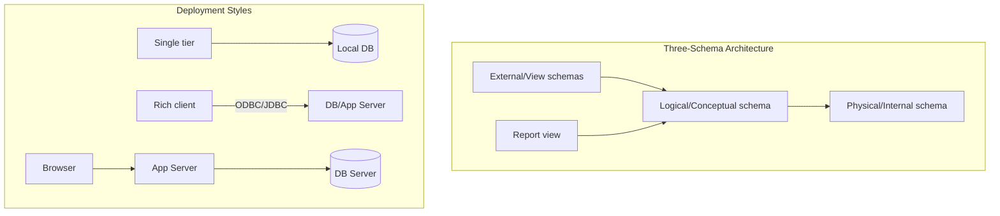

# Lec-02: DBMS Architecture

## Quick Highlights
- Three-schema architecture: external, conceptual, physical; enables data independence.
- Physical vs logical vs view schemas; goal is efficient storage plus simple access.
- DB languages: DDL for schema/constraints, DML for queries/updates.
- DBA responsibilities: schema design, storage, auth, maintenance, backups, patches.
- App access via APIs like ODBC/JDBC; 1-tier/2-tier/3-tier client-server patterns.

## Diagram


## Full Notes
Use the highlights for a quick scan; expand below for the verbatim PDF text.
<details>
<summary>Show raw lecture notes</summary>

```text
1. View of Data (Three-schema architecture)
a. Purpose: a DBMS provides users an abstract view of data, hiding implementation details about storage and maintenance.
b. Abstraction is organized across multiple levels to simplify user interaction.
c. Goal of the three-schema architecture: let multiple users access the same underlying data through personalized views while keeping a single physical copy.

d. Physical (internal) level
  i. Lowest level of abstraction; describes how data are physically stored.
  ii. Includes storage structures and file organization.
  iii. The physical schema describes the physical storage structure of the database.
  iv. Topics: storage allocation (e.g., B‑trees), compression, encryption, and record placement.
  v. Goal: define algorithms and structures that enable efficient data access.

e. Logical (conceptual) level
  i. The conceptual schema describes what data are stored and what relationships exist among them.
  ii. Users and application developers working at the logical level need not know physical storage details.
  iii. DBAs use the logical level to decide which information to keep and how to organize it.
  iv. Goal: provide a clear, consistent view of the data for applications.

f. View (external) level
  i. Highest level of abstraction; provides tailored views for different end users.
  ii. Each external schema (subschema) describes the portion of the database relevant to a user group and hides the rest.
  iii. Views also act as a security layer to restrict access to parts of the database.

2. Instances and Schemas
a. Instance: the collection of information stored in the database at a particular moment in time.
b. Schema: the overall design of the database (structure and constraints).
c. Schemas are stable and change infrequently; instances (data) change frequently.
d. The DB schema corresponds to variable/type declarations in a program.
e. Three schema types: physical, logical (conceptual), and view (external) schemas.
f. Logical schema is the primary interface used by application developers.
g. Physical data independence: changes to the physical schema should not affect the logical schema or applications.

3. Data models
a. A data model describes the logical organization of data and the conceptual tools to represent relationships, semantics, and constraints.
b. Examples: ER model, relational model, object-oriented model, object-relational model.

4. Database languages
a. Data Definition Language (DDL): specifies schemas and integrity constraints.
b. Data Manipulation Language (DML): expresses queries and updates.
c. In practice, a single language (e.g., SQL) provides both DDL and DML features.
d. DDL defines structure and constraints that must be enforced when data change.
e. DML operations include:
  i. Retrieval of stored information.
  ii. Insertion of new information.
  iii. Deletion of information.
  iv. Updating existing information.
  v. Query languages are part of DML and request information retrieval.

5. Accessing the database from applications
a. Applications (C/C++, Java, etc.) interact with the DB by issuing DML/DDL statements or using APIs.
b. Example: a payroll module issues DML statements to update employee accounts.
c. Common APIs: Open Database Connectivity (ODBC) for C/C++; Java Database Connectivity (JDBC) for Java.

6. Database administrator (DBA)
a. The DBA is responsible for the data and programs that access the data.
b. Typical DBA functions:
  i. Schema definition and design.
  ii. Storage structures and access methods.
  iii. Schema and physical organization changes.
  iv. Authorization and access control.
  v. Routine maintenance: backups, security patches, and upgrades.

7. DBMS application architectures
  Client machines run user front-ends; server machines run DBMS software.
a. One-tier (T1)
  i. Client, server, and database reside on the same machine.
b. Two-tier (T2)
  i. Application is partitioned into client and server components.
  ii. Client issues queries to the server; APIs like ODBC/JDBC are often used.
c. Three-tier (T3)
  i. Application is partitioned into three logical components: client, application server, and database.
  ii. Client is a thin frontend with no direct DB calls; the app server contains business logic and communicates with the DB.
  iii. Advantages: scalability, improved data integrity (centralized business logic), and better security.
```

</details>

## Interview Q&A
- **Q:** Explain physical vs logical data independence and why it matters.
  **A:** Physical independence means changing storage structures shouldn't break logical schemas; logical independence means view changes shouldn't break apps. This decoupling keeps apps stable as DBs evolve.
- **Q:** Compare 2-tier and 3-tier DB application architectures.
  **A:** 2-tier has client directly talk to DB server, simpler but harder to scale and secure; 3-tier inserts an app server for business logic, pooling, and security, which scales better on the web.
- **Q:** How would you expose different user-specific views without duplicating data?
  **A:** Use the external schema/view layer: create SQL views or APIs that project/secure subsets of the logical schema while the physical data stays single-sourced.
