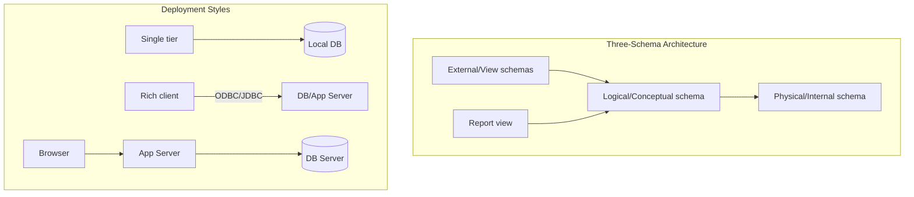

# Lec-02: DBMS Architecture

## Quick Highlights
- Three-schema architecture: external, conceptual, physical; enables data independence.
- Physical vs logical vs view schemas; goal is efficient storage plus simple access.
- DB languages: DDL for schema/constraints, DML for queries/updates.
- DBA responsibilities: schema design, storage, auth, maintenance, backups, patches.
- App access via APIs like ODBC/JDBC; 1-tier/2-tier/3-tier client-server patterns.

## Diagram


## Full Notes
Use the highlights for a quick scan; expand below for the verbatim PDF text.
<details>
<summary>Show raw lecture notes</summary>

```text
1. View of Data (Three Schema Architecture)
a. The major purpose of DBMS is to provide users with an abstract view of the data. That is, the
system hides certain details of how the data is stored and maintained.
b. To
simplify user interaction with the system, abstraction is applied through several levels of
abstraction.
c. The main objective of three level architecture is to enable multiple users to access the same data
with a personalized view while storing the underlying data only once
d. Phys
ical level / Internal level
i. The lowest level of abstraction describes how the data are stored.
ii. Low-level data structures used.
iii. It has Physical schema which describes physical storage structure of DB.
iv. Talks about: Storage allocation (N-ary tree etc), Data compression & encryption etc.
v. Goal: We must define algorithms that allow efficient access to data.
e. Logical level / Conceptual level:
i. The conceptual schema describes the design of a database at the conceptual level,
describes wh at data are stored in DB, and what relationships exist among those data.
ii. User at logical level does not need to be aware about physical-level structures.
iii. DBA, who must decide what information to keep in the DB use the logical level of
abstraction.
iv
. Goal: ease to use.
f. View level / External level:
i. Highest level of abstraction aims to simplify users interaction with the system by
providing different view to different end-user.
ii. Each view schema describes the database part that a particular user group is interested
and hides the remaining database from that user group.
iii. At the external level, a database contains several schemas that sometimes called as
subschema. The subschema is used to describe the different view of the database.
iv. At views also provide a security mechanism to prevent users from accessing certain parts
of DB.
g.
2. Instances and Schemas
a. The collection of information stored in the DB at a particular moment is called an instance of DB.
b. The overall design of the DB is called the DB schema.
c. Schema is structural description of data. Schema doesnt change frequently. Data may change
frequently.
d. DB schema corresponds to the variable declarations (along with type) in a program.
e. We have 3 types of Schemas: Physical, Logical, several view schemas called subschemas.
f. Logical schema is most important in terms of its effect on application programs, as programmers
construct apps by using logical schema.
g. Physical data independence, physical schema change should not affect logical
sch
ema/application programs.
3. Data Models:
a. Provides a way to describe the design of a DB at logical level.
b. Underlying the structure of the DB is the Data Model; a collection of conceptual tools for describing
data, data relationships, data semantics & consistency constraints.
c. E.g., ER model, Relational Model, object-oriented model, object-relational data model etc.
4. Database Languages:
a. Data definition language (DDL) to specify the database schema.
b. Data manipulation language (DML) to express database queries and updates.
c. Practically, both language features are present in a single DB language, e.g., SQL language.
d. DDL
i. We specify consistency constraints, which must be checked, every time DB is updated.
e. DML
i. Data manipulation involves
1. Retrieval of information stored in DB.
2. Insertion of new information into DB.
3. Deletion of information from the DB.
4. Updating existing information stored in DB.
ii. Query language, a part of DML to specify statement requesting the retrieval of
information.
5. How is Database accessed from Application programs?
a. Apps (written in host languages, C/C++, Java) interacts with DB.
b. E.g., Banking systems module generating payrolls access DB by executing DML statements from
the host language.
c. API is provided to send DML/DDL statements to DB and retrieve the results.
i. Open Database Connectivity (ODBC), Microsoft C.
ii. Java Database Connectivity (JDBC), Java.
6. Database Administrator (DBA)
a. A person who has central control of both the data and the programs that access those data.
b. Functions of DBA
i. Schema Definition
ii. Storage structure and access methods.
iii. Schema and physical organization modifications.
iv. Authorization control.
v. Routine maintenance
1. Periodic backups.
2. Security patches.
3. Any upgrades.
7. DBMS Application Architectures: Client machines, on which remote DB users work, and server machines
on which DB system runs.
a. T1 Architecture
i. The client, server & DB all present on the same machine.
b. T2 Architecture
i. App is partitioned into 2-components.
ii. Client machine, which invokes DB system functionality at server end through query
la
nguage statements.
iii. API standards like ODBC & JDBC are used to interact between client and server.
c. T3 Architecture
i. App is partitioned into 3 logical components.
ii. Client machine is just a frontend and doesnt contain any direct DB calls.
iii. Client machine communicates with App server, and App server communicated with DB
system to access data.
iv. Business logic, what action to take at that condition is in App server itself.
v. T3 architecture are best for WWW Applications.
vi. Advantages:
1. Scalability due to distributed application servers.
2. Data integrity, App server acts as a middle layer between client and DB, which
minimize the chances of data corruption.
3. Security, client cant directly access DB, hence it is more secure.
```

</details>

## Interview Q&A
- **Q:** Explain physical vs logical data independence and why it matters.
  **A:** Physical independence means changing storage structures shouldn't break logical schemas; logical independence means view changes shouldn't break apps. This decoupling keeps apps stable as DBs evolve.
- **Q:** Compare 2-tier and 3-tier DB application architectures.
  **A:** 2-tier has client directly talk to DB server, simpler but harder to scale and secure; 3-tier inserts an app server for business logic, pooling, and security, which scales better on the web.
- **Q:** How would you expose different user-specific views without duplicating data?
  **A:** Use the external schema/view layer: create SQL views or APIs that project/secure subsets of the logical schema while the physical data stays single-sourced.
