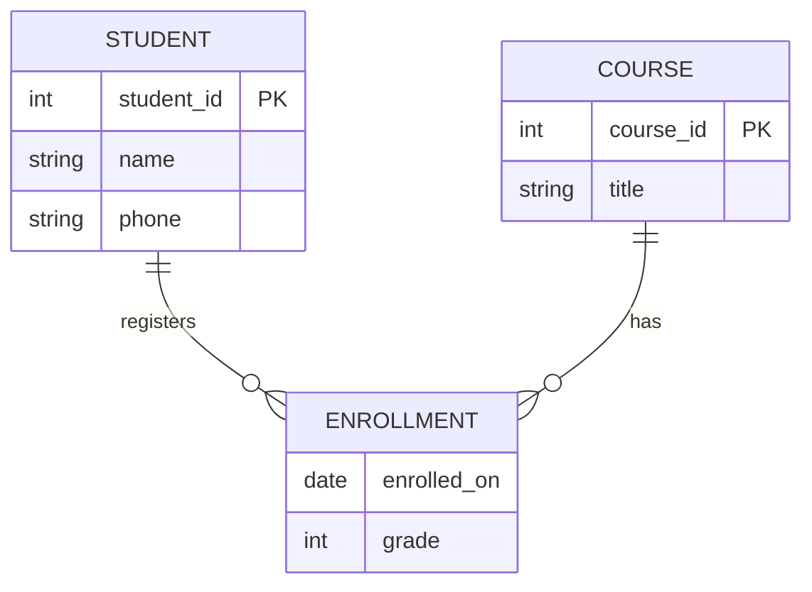

# Lec-03: Entity-Relationship Model

## Quick Highlights
- ER model represents entities, attributes, and relationships as a conceptual blueprint.
- Entities have keys; strong vs weak entities (depend on owners).
- Attributes can be simple/composite, single/multi-valued, derived; null reasons vary.
- Relationships carry cardinality (1:1, 1:N, N:M) and participation (total/partial).
- Unary/binary/ternary relationship degrees; mapping impacts schema design.

## Diagram


## Full Notes
Use the highlights for a quick scan; expand below for the verbatim PDF text.
<details>
<summary>Show raw lecture notes</summary>

```text
1. Data Model
  A collection of conceptual tools for describing data, relationships, semantics, and consistency constraints.

2. ER Model
  a. A high-level data model that represents a perception of the real world as a collection of entities
    and relationships among those entities.
  b. The graphical representation is an ER diagram, which serves as a blueprint for the database.

3. Entity
  a. An entity is a distinguishable object in the real world (e.g., a student) that has a physical or conceptual existence.
  b. Each entity can be uniquely identified by a primary attribute (Primary Key).
  c. Strong entity: can be uniquely identified on its own.
  d. Weak entity: cannot be uniquely identified without a relationship to a strong (owner) entity.
    i. A weak entity lacks sufficient attributes to form a primary key on its own.
    ii. Example: Payment may be a weak entity dependent on Loan; installment numbers may be unique per loan.
    iii. A weak entity depends on its owner for existence.

4. Entity Set
  a. A set of entities of the same type that share the same properties (attributes).
  b. Examples: Student (entity set), Customer (entity set).

5. Attributes
  a. An entity is represented by a set of attributes; each entity has a value for each attribute.
  b. The domain (value set) specifies permitted values for an attribute.
  c. Example attributes for Student: Student_ID, Name, Standard, Course, Batch, ContactNumber, Address.

  Types of attributes:
  i. Simple: cannot be divided further (e.g., account number, roll number).
  ii. Composite: can be divided into subparts (e.g., Name -> first, middle, last; Address -> street, city, state, PIN).
  iii. Single-valued: only one value (e.g., Student_ID).
  iv. Multi-valued: can have multiple values (e.g., phone numbers, dependents); limits may be applied.
  v. Derived: value computed from other attributes (e.g., Age derived from DateOfBirth).

  NULL values:
  - An attribute takes NULL when an entity has no value for it; NULL may mean not applicable, missing, or unknown.
  - Examples: missing middle name (not applicable), unknown salary (not known yet).

6. Relationships
  a. An association among two or more entities (e.g., Person owns Vehicle; Parent has Child; Customer borrows Loan).
  b. Strong relationship: between independent entities.
  c. Weak relationship: between a weak entity and its owner (strong entity), e.g., Loan -> Payment (installments).

  Degree of a relationship:
  - The number of entity types participating in the relationship.
  i. Unary (degree 1): only one entity type participates (e.g., Employee manages Employee).
  ii. Binary (degree 2): two entity types participate (common case, e.g., Student takes Course).
  iii. Ternary (degree 3): three entity types participate (e.g., Employee assigned to Job at Branch).

7. Relationship Constraints
  a. Mapping cardinality (cardinality ratio): number of entities to which another entity can be associated.
    i. One-to-one (1:1): an entity in A associates with at most one entity in B, and vice versa (e.g., Citizen -> Aadhar).
    ii. One-to-many (1:N): an entity in A associates with many in B, while an entity in B associates with at most one in A (e.g., Citizen -> Vehicles).
    iii. Many-to-one (N:1): inverse of 1:N (e.g., Course -> Professor if each course has one professor but a professor teaches many courses).
    iv. Many-to-many (M:N): entities in A can associate with many in B and vice versa (e.g., Student attends Course; Customer buys Product).

  b. Participation constraints (minimum cardinality)
    - Partial participation: not all entities must be involved in the relationship instance.
    - Total participation: each entity must be involved in at least one relationship instance.
    - Example: Loan has total participation with Customer (a Loan cannot exist without a Customer); Customer may have partial participation.
    - Weak entities usually have total participation with their owning entity.

8. ER Notations
```

</details>

## Interview Q&A
- **Q:** When do you model something as a weak entity?
  **A:** Use a weak entity when it lacks a full primary key on its own (e.g., Payment depends on Loan) and must include the owner's key plus a partial discriminator.
- **Q:** How do cardinality and participation constraints influence schema design?
  **A:** They drive key/FK placement and uniqueness/nullability (e.g., total participation often means NOT NULL FK; one-to-one may suggest merging tables).
- **Q:** Give an example where a ternary relationship is preferable to three binaries.
  **A:** Assigning an employee to a job at a branch; ternary preserves the joint constraint that involves all three rather than three looser binary links.
