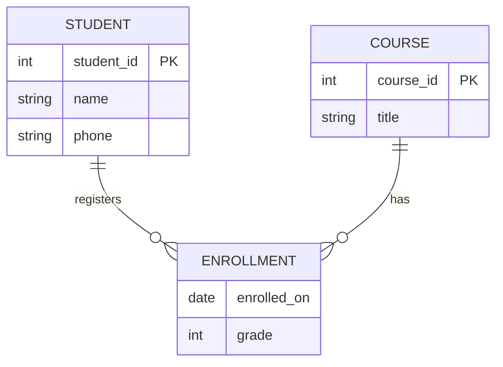

# Lec-03: Entity-Relationship Model

## Quick Highlights
- ER model represents entities, attributes, and relationships as a conceptual blueprint.
- Entities have keys; strong vs weak entities (depend on owners).
- Attributes can be simple/composite, single/multi-valued, derived; null reasons vary.
- Relationships carry cardinality (1:1, 1:N, N:M) and participation (total/partial).
- Unary/binary/ternary relationship degrees; mapping impacts schema design.

## Diagram


## Full Notes
Use the highlights for a quick scan; expand below for the verbatim PDF text.
<details>
<summary>Show raw lecture notes</summary>

```text
1. Data Model: Collection of conceptual tools for describing data, data relationships, data semantics, and consistency
constraints.
2. ER Model
1. It is a high level data model based on a perception of a real world that consists of a collection of basic objects, called
entities and of relationships among these objects.
2. Graphical representation of ER Model is ER diagram, which acts as a blueprint of DB.
3. Entity: An Entity is a thing or object in the real world that is distinguishable from all other objects.
1. It has physical existence.
2. Each student in a college is an entity.
3. Entity can be uniquely identified. (By a primary attribute, aka Primary Key)
4. Strong Entity: Can be uniquely identified.
5. Weak Entity: Cant be uniquely identified., depends on some other strong entity.
1. It doesnt have sucient attributes, to select a uniquely identi fiable attribute.
2. Loan -> Strong Entity, Payment -> Weak, as instalments are sequential number counter can be generated
separate for each loan.
3. Weak entity depends on strong entity for existence.
4. Entity set
1. It is a set of entities of the same type that share the same properties, or a ttributes.
2. E.g., Student is an entity set.
3. E.g., Customer of a bank
5. Attributes
1. An entity is represented by a set of attributes.
2. Each entity has a value for each of its attributes.
3. For each attribute, there is a set of permitted values, called the domain, or value set, of that attribute.
4. E.g., Student Entity has following a ttributes
A. Student_ID
B. Name
C. Standard
D. Course
E. Batch
F. Contact number
G. Address
5. Types of Attributes
1. Simple
1. Attributes which cant be divided further.
2. E.g., Customers account number in a bank, Students Roll number etc.
2. Composite
1. Can be divided into subparts (that is, other a ttributes).
2. E.g., Name of a person, can be divided into first-name, middle-name, last-name.
3. If user wants to refer to an entire attribute or to only a component of the attribute.
4. Address can also be divided, street, city, state, PIN code.
3. Single-valued
1. Only one value attribute.
2. e.g., Student ID, loan-number for a loan.
4. Multi-valued
1. Attribute having more than one value.
2. e.g., phone-number, nominee-name on some insurance, dependent-name etc.
3. Limit constraint may be applied, upper or lower limits.
5. Derived
1. Value of this type of attribute can be derived from the value of other related attributes.
2. e.g., Age, loan-age, membership-period etc.
6. NULL Value
1. An attribute takes a null value when an entity does not have a value for it.
2. It may indicate not applicable, value doesnt exist. e.g., person having no middle-name
3. It may indicate unknown.
1. Unknown can indicate missing entry, e.g., name value of a customer is NULL, means it is missing as name
must have some value.
2. Not known, salary attribute value of an employee is null, means it is not known yet.
6. Relationships
1. Association among two or more entities.
2. e.g., Person has vehicle, Parent has Child, Customer borrow loan etc.
3. Strong Relationship, between two independent entities.
4. Weak Relationship, between weak entity and its owner/strong entity.
1. e.g., Loan <instalment-payments> Payment.
5. Degree of Relationship
1. Number of entities participating in a relationship.
2. Unary, Only one entity participates. e.g., Employee manages employee.
3. Binary, two entities participates. e.g., Student takes Course.
4. Ternary relationship, three entities participates. E.g, Employee works-on branch, employee works-on job.
5. Binary are common.
7. Relationships Constraints
1. Mapping Cardinality / Cardinality Ratio
1. Number of entities to which another entity can be associated via a relationship.
2. One to one, Entity in A associates with at most one entity in B, where A & B are entity sets. And an entity
of B is associated with at most one entity of A.
1. E.g., Citizen has Aadhar Card.
3. One to many, Entity in A associated with N entity in B. While entity in B is associated with at most one
entity in A.
1. e.g., Citizen has Vehicle.
4. Many to one, Entity in A associated with at most one entity in B. While entity in B can be associated with
N entity in A.
1. e.g., Course taken by Professor.
5. Many to many, Entity in A associated with N entity in B. While entity in B also associated with N entity in
A.
1. Customer buys product.
2. Student attend course.
2. Participation Constraints
1. Aka, Minimum cardinality constraint.
2. Types, Partial & Total Participation.
3. Partial Participation, not all entities are involved in the relationship instance.
4. Total Participation, each entity must be involved in at least one relationship instance.
5. e.g., Customer borrow loan, loan has total participation as it cant exist without customer entity. And
customer has partial participation.
6. Weak entity has total participation constraint, but strong may not have total.
8. ER Notations
```

</details>

## Interview Q&A
- **Q:** When do you model something as a weak entity?
  **A:** Use a weak entity when it lacks a full primary key on its own (e.g., Payment depends on Loan) and must include the owner's key plus a partial discriminator.
- **Q:** How do cardinality and participation constraints influence schema design?
  **A:** They drive key/FK placement and uniqueness/nullability (e.g., total participation often means NOT NULL FK; one-to-one may suggest merging tables).
- **Q:** Give an example where a ternary relationship is preferable to three binaries.
  **A:** Assigning an employee to a job at a branch; ternary preserves the joint constraint that involves all three rather than three looser binary links.
