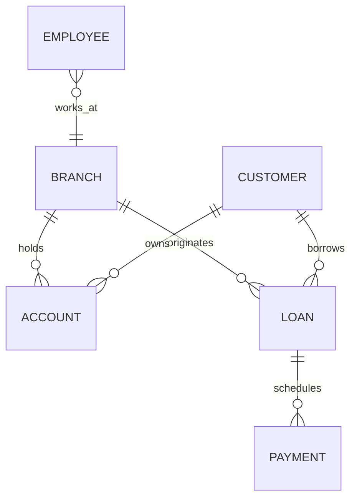

# Lec-05: ER Diagram Workflow & Banking System Case

## Quick Highlights
- ER diagramming workflow: identify entities, attributes, relationships, mapping, participation.
- Banking case: Branch, Customer, Employee, Account (savings/current), Loan, Payment (weak).
- Branch originates loans; customers own accounts and loans; payments depend on loans.
- Multi-valued attributes (phones, dependents) modeled separately; account generalized.

## Diagram


## Full Notes
Use the highlights for a quick scan; expand below for the verbatim PDF text.
<details>
<summary>Show raw lecture notes</summary>

```text
* stepsto make ER diagram1-
 identifyEntitysets.
 identifyattributes& their types.
 "
Rel" & constraints
 Mapping Participation__
* F-R-moddof-B-ank.mgSystem
 Bankingsystem- Branches.
( maf)
 Bank customers.
 Customers- accounts.
, & take loan.
 Customer associatedwith some banker.
 Bank has employees.
 Accounts-
savingall\ current a /c.
 Loan originatedby branch
loan  1 customers.
paymentschedules.
 Entitysets
 Branch  Customer  Employee
 SavingA/c  Currenta/c
 Loan  paymentKwan) ( weakentity?
 Attributes: -
 branch Lame, city, arrests, liabilities
 Customer cent- id , name , address, contact no .
DOBTage,   Composite.
multicolored.
derived.
 Genployee acid, name , contactno ,
, dependentname ,
yearsof service, stat - date  mltivalued.
derivedaltnhr singlevalued.
 Savingaccount intent - rate
, dailywithdrawallimit.
 Unmeta/c af , pertanaetwnchanges,
overdraft- amount.
GeneralizedEntity"
Account"
 ace - no ,
, balance
 Loan lber , amount
 WeakEntityPayment Paymentno .
, date, amount.
 Rel"
& constants.
 Customer borrow loans,
M : N
=
 Loan originatedby branch.
N % r

 Loan loan-
payment Payment.
=
 % N
 Customer deposit account
M % N
 Customer banker Employee.
N % A
 Cenployee manageby Employee.
N % I
sta mi-tbranI
-  Paymg!PYmntdcuwd# originated1 by
\ / in loanborrow_tLoan T-
payment   t.nmton.IM
M loan=am
aecont-mn-yhfybalane.ecbanker
,w deposit
n /accounts / 
?PyT managedby is-
a
dai1ynthdm!ua limit
"
iammtak=-Plsay.mg#-changeshave
ovw-draftamowt@pinterest.at#
"#  Onlinedeliverysystem.
 University
```

</details>

## Interview Q&A
- **Q:** Walk me through building a banking ERD under 5 minutes.
  **A:** Identify entities (Branch, Customer, Account, Loan, Employee, Payment), set keys, map relationships (customer-accounts many-to-many via ownership, branch-originates-loan), and note weak entities like Payment.
- **Q:** How do you capture multi-valued attributes such as customer phone numbers?
  **A:** Model them as separate related tables (CustomerPhone) or JSON arrays when supported, instead of repeating columns.
- **Q:** What is the right PK for a payment schedule table tied to loans?
  **A:** Use a composite key of loan_id + installment_number or a surrogate with a unique constraint on that pair to preserve order and uniqueness.
