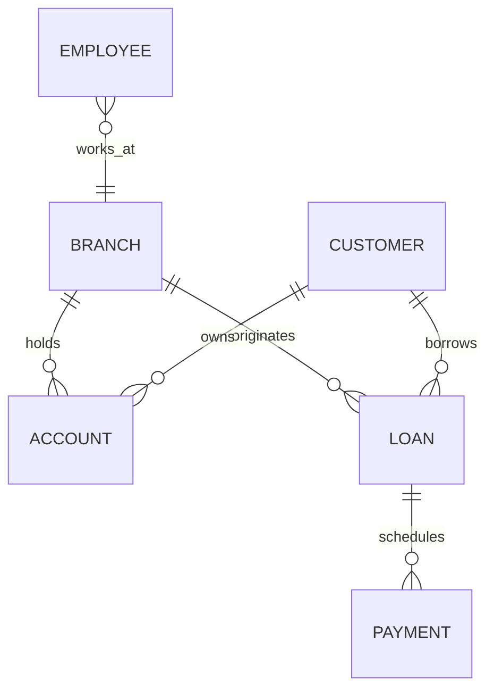

# Lec-05: ER Diagram Workflow & Banking System Case

## Quick Highlights
- ER diagramming workflow: identify entities, attributes, relationships, mapping, participation.
- Banking case: Branch, Customer, Employee, Account (savings/current), Loan, Payment (weak).
- Branch originates loans; customers own accounts and loans; payments depend on loans.
- Multi-valued attributes (phones, dependents) modeled separately; account generalized.

## Diagram


## Full Notes
Use the highlights for a quick scan; expand below for the verbatim PDF text.
<details>
<summary>Show raw lecture notes</summary>

```text
dai1ynthdm!ua limit
1. Steps to create an ER diagram
  a. Identify entity sets.
  b. Identify attributes and their types (simple, composite, multi-valued, derived).
  c. Identify relationships and constraints (cardinality, participation).
  d. Map relationships and participation constraints; mark weak entities where applicable.

2. Banking system case (conceptual model)
  - Key entity sets: Branch, Customer, Employee, Account (Savings, Current), Loan, Payment (weak).
  - Overview: Branches serve customers; customers hold accounts and may take loans; loans are originated by branches; payments are scheduled against loans; employees (bankers) are associated with customers/branches.

3. Entity sets (examples)
  - Branch
  - Customer
  - Employee
  - SavingAccount (Savings A/c)
  - CurrentAccount (Current A/c)
  - Loan
  - Payment (weak entity tied to Loan)

4. Attributes (examples and types)
  - Branch: branch_name, city, assets, liabilities
  - Customer: customer_id (PK), name, address, contact_no, DOB (can derive age)
    - Composite attributes: address (street, city, state, PIN)
    - Multi-valued: phone_numbers
    - Derived: age (from DOB)
  - Employee: employee_id (PK), name, contact_no, dependents (multi-valued), years_of_service, start_date
  - SavingsAccount: account_no (PK), balance, interest_rate, daily_withdrawal_limit
  - CurrentAccount: account_no (PK), balance, overdraft_amount
  - Loan: loan_id (PK), amount, loan_type
  - Payment (weak): payment_no (partial key), date, amount (weak entity keyed by loan_id + payment_no or surrogate)

5. Generalization / Specialization
  - Account can be a generalized entity with SavingsAccount and CurrentAccount as specializations sharing account_no and balance.

6. Relationships and cardinalities (examples)
  - Customer borrows Loan: M:N (a customer can have many loans; a loan may be associated with multiple customers in co-borrower scenarios).
  - Loan originatedBy Branch: N:1 (each loan is originated by one branch; a branch can originate many loans).
  - Loan has Payment: 1:N (a loan has many payments/scheduled installments).
  - Customer owns Account: M:N (customers can own multiple accounts; accounts may have multiple authorized holders).
  - Customer — Banker(Employee): N:M or N:1 depending on rules (each customer may be associated with one banker or many; model according to requirements).
  - Employee manages Branch (works_at): N:1 (many employees work at one branch).

7. Notes on keys and weak entities
  - For Payment (weak entity): use composite key (loan_id, payment_no) or a surrogate PK and enforce uniqueness on (loan_id, payment_no) to preserve installment order.
  - For account-holder relationships where multiple customers can access an account, model an associative entity (AccountHolder) with role and ownership percentage if needed.

8. Additional modeling considerations
  - Model multi-valued attributes (phones, dependents) as separate related tables to avoid repeated columns.
  - Capture constraints such as daily withdrawal limits, overdraft amounts, and interest rates as attributes on account entities.
  - Where business rules require, record audit information (created_by, created_at) on transactions and schedules.

9. Workflow tip
  - Start with a high-level ER diagram (entities and major relationships), then refine by adding attributes, cardinalities, participation constraints, and weak entities; finally map to relational schema (tables, PKs, FKs, and constraints).

10. Example mapping summary (quick)
  - Branch(branch_id PK, name, city, assets, liabilities)
  - Customer(customer_id PK, name, address, contact_no, DOB)
  - Employee(employee_id PK, name, contact_no, branch_id FK)
  - Account(account_no PK, balance, type, branch_id FK)
  - SavingsAccount(account_no PK, interest_rate, daily_withdrawal_limit)
  - CurrentAccount(account_no PK, overdraft_amount)
  - Loan(loan_id PK, amount, originated_branch_id FK)
  - Payment(payment_id PK or composite (loan_id, payment_no), loan_id FK, date, amount)

11. Interview-ready talking points
  - Explain how you would choose primary keys (natural vs surrogate) and when to use composite keys (e.g., scheduled payments).
  - Describe how to model multi-valued attributes and weak entities.
  - Show how generalization (Account -> Savings/Current) reduces duplication.
  - Discuss trade-offs (denormalization for performance vs strict normalization for data integrity).
```

</details>

## Interview Q&A
- **Q:** Walk me through building a banking ERD under 5 minutes.
  **A:** Identify entities (Branch, Customer, Account, Loan, Employee, Payment), set keys, map relationships (customer-accounts many-to-many via ownership, branch-originates-loan), and note weak entities like Payment.
- **Q:** How do you capture multi-valued attributes such as customer phone numbers?
  **A:** Model them as separate related tables (CustomerPhone) or JSON arrays when supported, instead of repeating columns.
- **Q:** What is the right PK for a payment schedule table tied to loans?
  **A:** Use a composite key of loan_id + installment_number or a surrogate with a unique constraint on that pair to preserve order and uniqueness.
