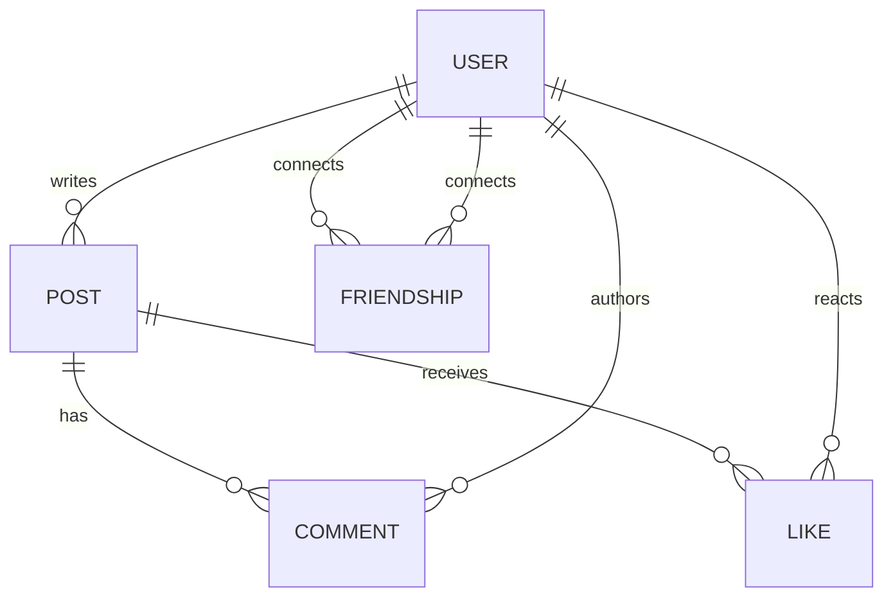

# Lec-06: Facebook Mini-Project ERD

## Quick Highlights
- Facebook mini-ERD: User profiles, Posts, Comments, Likes, Friendships.
- Posts have content/media/timestamps; users author posts/comments/likes.
- Friendship is an M:N self-relationship; likes/comments are 1:N from posts.
- Model supports feed-building via relationships among users and posts.

## Diagram


## Full Notes
Use the highlights for a quick scan; expand below for the verbatim PDF text.
<details>
<summary>Show raw lecture notes</summary>

```text
Facebook ERD notes (cleaned)

1. Overview / Use case
  - Model a simplified Facebook-like system with user profiles, posts, comments, likes, and friendships.
  - Users create posts (text/media), other users can like and comment on posts, and users form friendship connections (self-referential M:N relationship).

2. Identify entity sets
  - User (profile)
  - Post
  - Comment
  - Like
  - Friendship (self-relationship between users; can be modeled as an associative entity)

3. Sample attributes
  - User: user_id (PK), name, handle/username, email, phone, profile_pic, bio
    - DOB (derive age), composite address if needed, multi-valued attributes like alternate phone numbers
  - Post: post_id (PK), author_id (FK -> User), content (text), media (images/videos metadata), created_at, modified_at
  - Comment: comment_id (PK), post_id (FK -> Post), author_id (FK -> User), content, created_at
  - Like: like_id (PK) or composite key (user_id, post_id), post_id (FK), user_id (FK), created_at
  - Friendship: user_a_id, user_b_id, status (requested/accepted/blocked), created_at (use canonical ordering to enforce uniqueness)

4. Relationships and cardinalities (examples)
  - User POSTS Post: 1:N (a user can create many posts; each post has one author).
  - Post HAS Comment: 1:N (a post can have many comments; each comment belongs to one post).
  - User AUTHORS Comment: 1:N (a user can write many comments).
  - Post HAS Like: 1:N (a post can have many likes).
  - User REACTS (Like) Post: 1:N (a user can like many posts); model Like as associative entity for M:N if users can like many posts and a post receives many likes.
  - User FRIENDS User: M:N self-relationship (friends are mutual or modeled with status for requests/blocking).

5. Key & modeling notes
  - For Like, prefer composite key (user_id, post_id) to avoid duplicate likes by the same user; add timestamp for ordering.
  - For Friendship, store one row per pair with canonical ordering (min(user_a,user_b), max(user_a,user_b)) and a unique constraint to avoid duplication; include `status` and `created_at`.
  - For Comment and Like, consider surrogate keys for easier references and add FK constraints to maintain integrity.

6. Feed & visibility considerations
  - To build a user's feed, join posts from the user's friends and any public posts, ordered by `created_at` and ranked by relevance.
  - Store denormalized counters (like_count, comment_count) on Post for fast reads; update via background jobs or atomic counters.

7. Example relational mapping summary
  - USER(user_id PK, name, username, email, phone, dob, profile_pic, bio)
  - POST(post_id PK, author_id FK -> USER, content, media_json, created_at, modified_at, like_count, comment_count)
  - COMMENT(comment_id PK, post_id FK -> POST, author_id FK -> USER, content, created_at)
  - LIKE(user_id FK -> USER, post_id FK -> POST, created_at) -- composite PK (user_id, post_id)
  - FRIENDSHIP(user_a_id, user_b_id, status, created_at) -- unique constraint on (user_a_id, user_b_id)

8. Interview-ready talking points
  - Explain why composite keys (user_id, post_id) are useful for Like.
  - Discuss how to prevent duplicate friendships and how to model friend requests vs. accepted friendships.
  - Describe scaling strategies for hot posts: caching, sharded counters, and event-driven aggregation for counts.
```

</details>

## Interview Q&A
- **Q:** Design a minimal schema for news-feed posts.
  **A:** User table, Post table (id, author_id, content, media, timestamps), Like and Comment tables linked to both post and user, plus Friendship edges for visibility.
- **Q:** How would you scale the like counter on hot posts?
  **A:** Use write sharding or counters in cache with periodic aggregation, avoiding per-like row locks on the base post record.
- **Q:** What edge cases appear in friendship modeling?
  **A:** Bidirectionality/confirmation, blocking, and ensuring uniqueness per user pair, often via canonical ordering of user_ids with a unique constraint.
