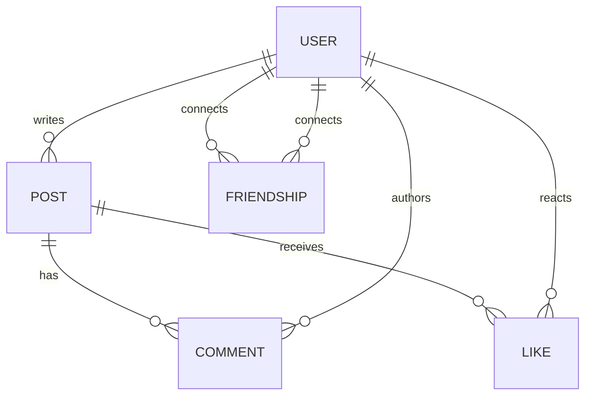

# Lec-06: Facebook Mini-Project ERD

## Quick Highlights
- Facebook mini-ERD: User profiles, Posts, Comments, Likes, Friendships.
- Posts have content/media/timestamps; users author posts/comments/likes.
- Friendship is an M:N self-relationship; likes/comments are 1:N from posts.
- Model supports feed-building via relationships among users and posts.

## Diagram


## Full Notes
Use the highlights for a quick scan; expand below for the verbatim PDF text.
<details>
<summary>Show raw lecture notes</summary>

```text
Facebook-
DB formulateusingERIdel.
* F-R_dgran
 Features.
& use case .
 profile men _ profiles friends,
 her can post
 Post  contains tent content, images, videos.
 Post like , comment.
 identifyentitysets.
 her _ profile  her _
post  post_ comment
 post_
like
 AHribypes.
 her _ profile Name, heme , email, pound, contactno.
  tcomposite.
DOB, age.
 mvltrvdwd, mnltivdued,
derived.
 her _ post pustid, tentcontent, image, videosmdltivded Intruded,
created_ timestamp, madifed- timestop. .
 post-commet-post-comm-t.at,
tentcontent, timestamp.
 post_
like  pytkeid, timestamp
 Rel"
rants
 Mer _ profile frienship her _
profile.
M ! N
 user _
profile posts user - post.
p i N
=
 her _ profile can post_ like,
1 : N
=
 user _ pnfhe. Commentspost_ comment.
1 :
=N
 her _ post has post_ comment
1 ! N=
 Mer _ post has pvstlike1 : N
=
To f t t friendship
F Dqt!/pAt"J,Pst_cmmt[comments m n
/N
Tuser _
profile' can I post-ke'
II 1
has postsee) / '
/N has
user post'
I \modified
F.BE#D t"
```

</details>

## Interview Q&A
- **Q:** Design a minimal schema for news-feed posts.
  **A:** User table, Post table (id, author_id, content, media, timestamps), Like and Comment tables linked to both post and user, plus Friendship edges for visibility.
- **Q:** How would you scale the like counter on hot posts?
  **A:** Use write sharding or counters in cache with periodic aggregation, avoiding per-like row locks on the base post record.
- **Q:** What edge cases appear in friendship modeling?
  **A:** Bidirectionality/confirmation, blocking, and ensuring uniqueness per user pair, often via canonical ordering of user_ids with a unique constraint.
