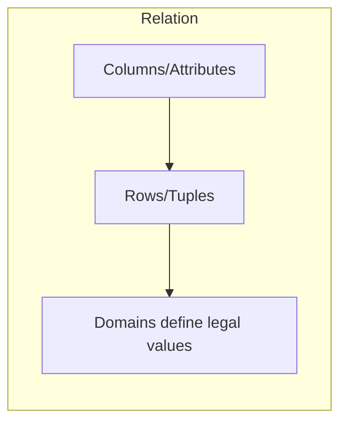

# Lec-07: Relational Model

## Quick Highlights
- Relational model stores data in named relations (tables) of tuples and attributes.
- Domains define legal values; relation schema = name + attributes + constraints.
- Keys (candidate/super) ensure uniqueness; degree = columns, cardinality = rows.
- Common RDBMS: Oracle, IBM DB2, MySQL, SQL Server; tuples represent facts.

## Diagram


## Full Notes
Use the highlights for a quick scan; expand below for the verbatim PDF text.
<details>
<summary>Show raw lecture notes</summary>

```text
1. Relational Model (RM)
  - The Relational Model organises data as relations (tables).
  - A relational database consists of a collection of named tables; each table stores tuples (rows) of attribute values.

2. Basic terms
  a. Tuple: a single row representing a unique record.
  b. Attribute/Column: describes a property of the relation; each attribute has a domain (permitted values).
  c. Relation schema: defines the relation name and its set of attributes (structure and constraints).
  d. Degree: number of attributes (columns) in a relation.
  e. Cardinality: number of tuples (rows) in a relation.

3. Properties of relations (tables)
  - Relation names must be unique in a database.
  - Attribute values must be atomic (no nested relations or non-atomic fields).
  - Attribute names (columns) must be unique within a relation.
  - Tuples in a relation must be unique (no duplicate rows).
  - The order of rows and columns is not significant.
  - Tables must satisfy integrity constraints to keep data consistent.

4. Common RDBMS examples
  - Oracle, IBM DB2, MySQL, Microsoft SQL Server, MS Access.

5. Keys in the relational model
  a. Super Key (SK): any set of attributes that uniquely identifies a tuple.
  b. Candidate Key (CK): a minimal super key (no redundant attributes). Candidate key values should not be NULL.
  c. Primary Key (PK): a chosen candidate key used to identify tuples.
  d. Alternate Key (AK): any candidate key that is not the primary key.
  e. Foreign Key (FK): an attribute (or set of attributes) in one relation that references the PK of another relation (establishes relationships between tables).
  f. Composite Key: a key composed of two or more attributes.
  g. Compound Key: a key formed using two foreign keys.
  h. Surrogate Key: synthetic key generated by the DB (e.g., auto-increment integer) often used as the PK.

6. Integrity constraints
  - Integrity constraints enforce correctness and prevent accidental corruption of the database.

  a. Domain constraints: restrict allowed values for an attribute (data type, range, format). Example: restrict enrolment to candidates born before 2002.
  b. Entity (key) constraints: every relation should have a primary key; PK values cannot be NULL.
  c. Referential (foreign key) constraints: a FK value in a referencing relation must either be NULL or appear as a PK value in the referenced relation.

7. Common key-related constraints supported by RDBMS
  i. NOT NULL: prevents NULL values in a column.
  ii. UNIQUE: ensures all values in a column are distinct.
  iii. DEFAULT: supplies a default value when none is provided.
  iv. CHECK: enforces a boolean condition on column values.
  v. PRIMARY KEY: enforces uniqueness and NOT NULL on the chosen column(s).
  vi. FOREIGN KEY: enforces referential integrity between relations and prevents operations that would break links between tables (unless cascades are defined).
```

</details>

## Interview Q&A
- **Q:** Difference between candidate key, primary key, and super key?
  **A:** Super key: any set of attributes uniquely identifying tuples; candidate key: minimal super key; primary key: the chosen candidate key used for PK/FK references.
- **Q:** What are integrity constraints in the relational model?
  **A:** Domain, entity integrity (PK not null/unique), and referential integrity (FK must match or be null), enforced via constraints and indexes.
- **Q:** Why is relation degree and cardinality useful?
  **A:** They describe width (attributes) and size (rows), guiding indexing, normalization, and query cost expectations.
