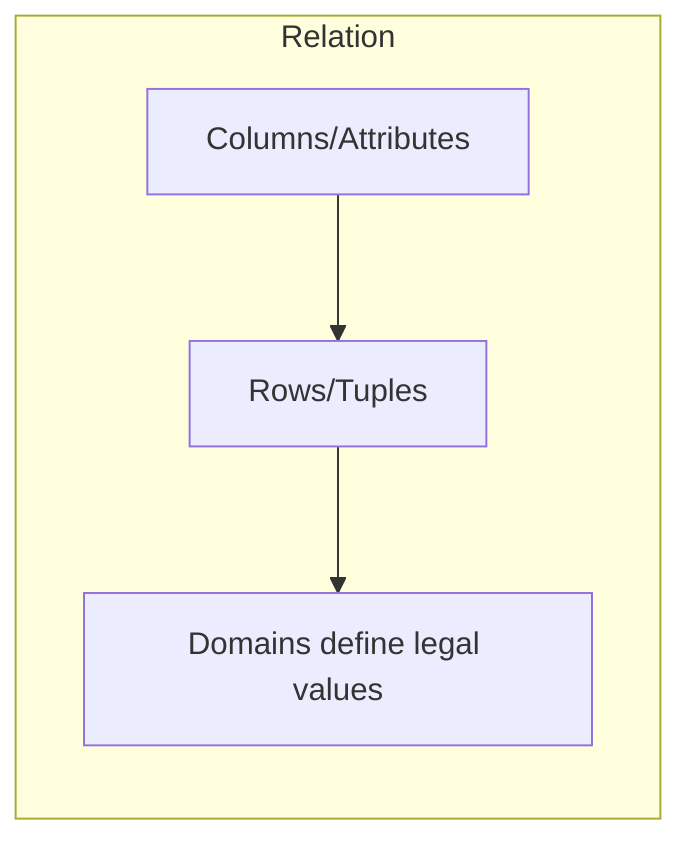

# Lec-07: Relational Model

## Quick Highlights
- Relational model stores data in named relations (tables) of tuples and attributes.
- Domains define legal values; relation schema = name + attributes + constraints.
- Keys (candidate/super) ensure uniqueness; degree = columns, cardinality = rows.
- Common RDBMS: Oracle, IBM DB2, MySQL, SQL Server; tuples represent facts.

## Diagram


## Full Notes
Use the highlights for a quick scan; expand below for the verbatim PDF text.
<details>
<summary>Show raw lecture notes</summary>

```text
1. Relational Model (RM) organises the data in the form of relations (tables).
2. A relational DB consists of collection of tables, each of which is assigned a unique name.
3. A row in a table represents a relationship among a set of values, and table is collection of such relationships.
4. Tuple: A single row of the table representing a single data point / a unique record.
5. Columns: represents the attributes of the relation. Each attribute, there is a permitted value, called domain of the
attribute.
6. Relation Schema: defines the design and structure of the relation, contains the name of the relation and all the
columns/attributes.
7. Common RM based DBMS systems, aka RDBMS: Oracle, IBM, MySQL, MS Access.
8. Degree of table: number of attributes/columns in a given table/relation.
9. Cardinality: Total no. of tuples in a given relation.
10. Relational Key: Set of attributes which can uniquely identify an each tuple.
11. Important properties of a Table in Relational Model
1. The name of relation is distinct among all other relation.
2. The values have to be atomic. Cant be broken down further.
3. The name of each attribute/column must be unique.
4. Each tuple must be unique in a table.
5. The sequence of row and column has no significance.
6. Tables must follow integrity constraints - it helps to maintain data consistency across the tables.
12. Relational Model Keys
1. Super Key (SK): Any P&C of attributes present in a table which can uniquely identify each tuple.
2. Candidate Key (CK): minimum subset of super keys, which can uniquely identify each tuple. It contains no
redundant attribute.
1. CK value shouldnt be NULL.
3. Primary Key (PK):
1. Selected out of CK set, has the least no. of a ttributes.
4. Alternate Key (AK)
1. All CK except PK.
5. Foreign Key (FK)
1. It creates relation between two tables.
2. A relation, say r1, may include among its attributes the PK of an other relation, say r2. This attribute is called FK
from r1 referencing r2.
3. The relation r1 is aka Referencing (Child) relation of the FK dependency, and r2 is called Referenced (Parent)
relation of the FK.
4. FK helps to cross reference between two di erent relations.
6. Composite Key: PK formed using at least 2 attributes.
7. Compound Key: PK which is formed using 2 FK.
8. Surrogate Key:
1. Synthetic PK.
2. Generated automatically by DB, usually an integer value.
3. May be used as PK.
13. Integrity Constraints
1. CRUD Operations must be done with some integrity policy so that DB is always consistent.
2. Introduced so that we do not accidentally corrupt the DB.
3. Domain Constraints
1. Restricts the value in the attribute of relation, specifies the Domain.
2. Restrict the Data types of every a ttribute.
3. E.g., We want to specify that the enrolment should happen for candidate birth year < 2002.
4. Entity Constraints
1. Every relation should have PK. PK != NULL.
5. Referential Constraints
1. Specified between two relations & helps maintain consistency among tuples of two relations.
2. It requires that the value appearing in specified attributes of any tuple in referencing relation also appear in the
specified attributes of at least one tuple in the referenced relation.
3. If FK in referencing table refers to PK of referenced table then every value of the FK in referencing table must be
NULL or available in referenced table.
4. FK must have the matching PK for its each value in the parent table or it must be NULL.
6. Key Constraints: The six types of key constraints present in the Database management system are:-
1. NOT NULL:  This constraint will restrict the user from not having a NULL value. It ensures that every element in
the database has a value.
2. UNIQUE: It helps us to ensure that all the values consisting in a column are di erent from each other.
3. DEFAULT: it is used to set the default value to the column. The default value is added to the columns if no value
is specified for them.
4. CHECK: It is one of the integrity constraints in DBMS. It keeps the check that integrity of data is maintained
before and after the completion of the CRUD.
5. PRIMARY KEY: This is an attribute or set of attributes that can uniquely identify each entity in the entity set. The
primary key must contain unique as well as not null values.
6. FOREIGN KEY: Whenever there is some relationship between two entities, there must be some common
attribute between them. This common attribute must be the primary key of an entity set and will become the
foreign key of another entity set. This key will prevent every action which can result in loss of connection
between tables.
```

</details>

## Interview Q&A
- **Q:** Difference between candidate key, primary key, and super key?
  **A:** Super key: any set of attributes uniquely identifying tuples; candidate key: minimal super key; primary key: the chosen candidate key used for PK/FK references.
- **Q:** What are integrity constraints in the relational model?
  **A:** Domain, entity integrity (PK not null/unique), and referential integrity (FK must match or be null), enforced via constraints and indexes.
- **Q:** Why is relation degree and cardinality useful?
  **A:** They describe width (attributes) and size (rows), guiding indexing, normalization, and query cost expectations.
