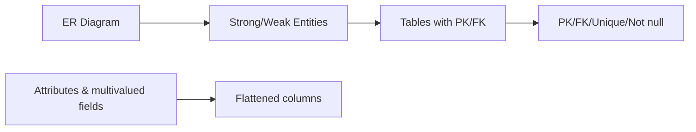

# Lec-08: Transform - ER Model to Relational Model

## Quick Highlights
- Goal: convert ER designs into relational schemas while keeping semantics.
- Strong entities become tables with PK; weak entities include owner PK in composite key.
- M:N relationships become bridge tables with both FKs plus relationship attributes.
- Multivalued attributes move to separate tables; specialization handled via PK/FK patterns.

## Diagram


## Full Notes
Use the highlights for a quick scan; expand below for the verbatim PDF text.
<details>
<summary>Show raw lecture notes</summary>

```text
1. Both ER-Model and Relational Model are abstract logical representation of real world enterprises. Because the two
models implies the similar design principles, we can convert ER design into Relational design.
2. Converting a DB representation from an ER diagram to a table format is the way we arrive at Relational DB-design from
an ER diagram.
3. ER diagram notations to relations:
1. Strong Entity
1. Becomes an individual table with entity name, attributes becomes columns of the relation.
2. Entitys Primary Key (PK) is used as Relations PK.
3. FK are added to establish relationships with other relations.
2. Weak Entity
1. A table is formed with all the attributes of the entity.
2. PK of its corresponding Strong Entity will be added as FK .
3. PK of the relation will be a composite PK, {FK + Partial discriminator Key}.
3. Single Values Attributes
1. Represented as columns directly in the tables/relations.
4. Composite Attributes
1. Handled by creating a separate attribute itself in the original relation for each composite a ttribute.
2. e.g., Address: {street-name, house-no}, is a composite a ttribute in customer relation, we add address-street-
name & address-house-name as new columns in the attribute and ignore address as an attribute.
5. Multivalued Attributes
1. New tables (named as original attribute name) are created for each multivalued attribute.
2. PK of the entity is used as column FK in the new table.
3. Multivalued attributes similar name is added as a column to define multiple values.
4. PK of the new table would be {FK + multivalued name}.
5. e.g., For Strong entity Employee, dependent-name is a multivalued a ttribute.
1. New table named dependent-name will be formed with columns emp-id, and dname.
2. PK: {emp-id, name}
3. FK: {emp-id}
6. Derived Attributes: Not considered in the tables.
7. Generalisation
1. Method-1: Create a table for the higher level entity set. For each lower-level entity set, create a table that
includes a column for each of the attributes of that entity set plus a column for each a ttribute of the primary key
of the higher-level entity set.
For e.g., Banking System generalisation of Account - saving & current.
1. Table 1: account (account-number, balance)
2. Table 2: savings-account (account-number, interest-rate, daily-withdrawal-limit)
3. Table 3: current-account (account-number, overdraft-amount, per-transaction-charges)
2. Method-2: An alternative representation is possible, if the generalisation is disjoint and completethat is, if no
entity is a member of two lower-level entity sets directly below a higher-level entity set, and if every entity in
the higher level entity set is also a member of one of the lower-level entity sets. Here, do not create a table for
the higher-level entity set. Instead, for each lower-level entity set, create a table that includes a column for each
of the attributes of that entity set plus a column for each a ttribute of the higher-level entity sets.
Tables would be:
1. Table 1: savings-account (account-number, balance, interest-rate, daily-withdrawal-limit)
2. Table 2: current-account (account-number, balance, overdraft-amount, per-transaction-charges)
3. Drawbacks of Method-2: If the second method were used for an overlapping generalisation, some values such
as balance would be stored twice unnecessarily. Similarly, if the generalisation were not completethat is, if
some accounts were neither savings nor current accountsthen such accounts could not be represented with
the second method.
8. Aggregation
1. Table of the relationship set is made.
2. Attributes includes primary keys of entity set and aggregation sets entities.
3. Also, add descriptive attribute if any on the relationship.
```

</details>

## Interview Q&A
- **Q:** How do you map a multi-valued attribute from ER to relational schema?
  **A:** Create a separate table with FK to the owning entity and the multi-valued attribute, turning the multi-valued field into multiple rows.
- **Q:** What happens to weak entities during transformation?
  **A:** They become tables whose PK includes the owner’s PK (as FK) plus their partial key, preserving total participation and dependency.
- **Q:** How do you map M:N relationships?
  **A:** Introduce a junction/bridge table containing FKs to both entities and any relationship attributes, with a composite PK or unique constraint.
