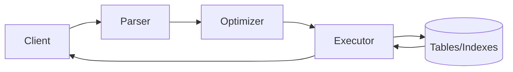

# Lec-09: SQL in 1-Video

## Quick Highlights
- SQL enables CRUD on RDBMS; MySQL uses client-server and SQL dialect.
- Data types range from numeric to text/blob; choose sizes carefully (e.g., VARCHAR).
- SQL command families: DDL, DML, DQL, DCL, TCL; transactions control atomicity.
- Covers selection, filtering, joins, grouping, aggregation, subqueries, views, set ops, functions.

## Diagram


## Full Notes
Use the highlights for a quick scan; expand below for the verbatim PDF text.
<details>
<summary>Show raw lecture notes</summary>

```text
1. SQL overview
  - SQL (Structured Query Language) is the standard language to access and manipulate relational data (CRUD).
  - CRUD mapping: CREATE (create structures/INSERT rows), READ (SELECT), UPDATE, DELETE.

2. RDBMS and SQL vs engine
  - An RDBMS (Relational Database Management System) implements the relational model (e.g., MySQL, PostgreSQL, Oracle).
  - SQL is the language; MySQL is an RDBMS that uses SQL to manage data and provide client-server services.

3. Common SQL data types (high level)
  - Character/text: CHAR(n), VARCHAR(n), TINYTEXT, TEXT, MEDIUMTEXT, LONGTEXT
  - Binary/blob: BLOB, MEDIUMBLOB, LONGBLOB
  - Integers: TINYINT, SMALLINT, MEDIUMINT, INT, BIGINT (sizes increase)
  - Floating: FLOAT, DOUBLE
  - Temporal: DATE, DATETIME, TIMESTAMP, TIME
  - Others: ENUM, SET, BOOLEAN, BIT(n)
  - Tip: prefer variable-length types (VARCHAR) for variable content; choose unsigned when needed.

4. SQL command families
  - DDL (Data Definition Language): CREATE, ALTER TABLE, DROP, TRUNCATE, RENAME
  - DQL/DRL (Data Query/Retrieval): SELECT
  - DML (Data Manipulation): INSERT, UPDATE, DELETE (also REPLACE in MySQL)
  - DCL (Data Control): GRANT, REVOKE
  - TCL (Transaction Control): START TRANSACTION, COMMIT, ROLLBACK, SAVEPOINT

5. Managing databases and schemas (examples)
  - CREATE DATABASE IF NOT EXISTS db_name;
  - USE db_name; -- switch current database
  - SHOW DATABASES; SHOW TABLES;

6. SELECT and filtering
  - Basic: SELECT col_list FROM table [WHERE condition];
  - WHERE, BETWEEN, IN, AND/OR/NOT, IS NULL, LIKE (% and _)
  - ORDER BY col [ASC|DESC]

7. GROUP BY and aggregation
  - GROUP BY groups rows for aggregate functions: COUNT, SUM, AVG, MIN, MAX
  - DISTINCT removes duplicates (similar effect to grouping without aggregates)
  - HAVING filters groups (applies after GROUP BY); WHERE filters rows before grouping

8. Constraints (DDL)
  - PRIMARY KEY: not null, unique
  - FOREIGN KEY: references another table's PK (can be multiple per table)
  - UNIQUE, CHECK, DEFAULT
  - Examples: FK with ON DELETE CASCADE or ON DELETE SET NULL; ON UPDATE CASCADE

9. ALTER TABLE operations: ADD, MODIFY, CHANGE COLUMN, DROP COLUMN, RENAME

10. DML examples
  - INSERT INTO table(col1,col2) VALUES (v1,v2), (v3,v4);
  - UPDATE table SET col = val WHERE cond;
  - DELETE FROM table WHERE cond; -- no WHERE deletes all rows

11. Joins
  - INNER JOIN: rows matching join condition between tables
  - LEFT/RIGHT JOIN: include all rows from left/right table and matching rows from the other
  - FULL JOIN: include all rows from both sides (can be emulated in MySQL using UNION of LEFT+RIGHT)
  - CROSS JOIN: Cartesian product
  - SELF JOIN: join a table to itself
  - Use explicit JOIN ... ON ... syntax and aliases (`AS`) for clarity

12. Set operations
  - UNION (distinct), UNION ALL (allow duplicates), INTERSECT and MINUS can be emulated using joins and filters
  - Columns and order must match across the SELECTs

13. Subqueries
  - Subqueries can appear in WHERE, FROM, or SELECT clauses
  - Correlated subqueries are evaluated per-row and depend on the outer query
  - Use subqueries when joins are not expressive enough or to encapsulate intermediate results

14. Views
  - A view is a virtual table defined by a query: CREATE VIEW v AS SELECT ...
  - Views don't store data themselves; changes to underlying tables reflect in the view

15. Practical guidance
  - Prefer joins for server-side set processing; subqueries can be simpler but may perform worse for correlated cases
  - Choose data types and indexes thoughtfully to balance storage and performance
  - Use transactions to maintain consistency across multiple DML operations
```

</details>

## Interview Q&A
- **Q:** INNER JOIN vs WHERE old-style joins—why prefer the former?
  **A:** Explicit JOINs clarify intent, support different join types (LEFT/RIGHT/FULL), and separate join predicates from filters, improving readability and optimizer hints.
- **Q:** When would you choose EXISTS over IN?
  **A:** EXISTS short-circuits and handles correlated checks efficiently; IN is fine for small static lists. EXISTS also avoids null/duplicate pitfalls in subqueries.
- **Q:** Explain GROUP BY vs DISTINCT.
  **A:** DISTINCT removes duplicates from the projection; GROUP BY aggregates rows by grouping columns and pairs with aggregate functions.
- **Q:** How do UNION and UNION ALL differ?
  **A:** UNION removes duplicates and sorts/hashed results; UNION ALL appends without deduping, so it is faster when duplicates are acceptable.
- **Q:** What is a window function and why is it useful?
  **A:** It performs calculations across related rows without collapsing them (e.g., running totals, row_number over partitions), enabling advanced analytics in SQL.
