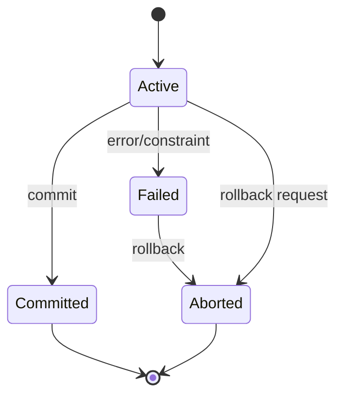

# Lec-12: Transaction

## Quick Highlights
- Transaction = logical unit of work; sequence and grouping matter.
- ACID: Atomicity, Consistency, Isolation, Durability ensure integrity.
- Concurrency control uses schedules (serial, serializable) and isolation levels.
- Abort/commit behaviors define outcome visibility and rollback handling.

## Diagram


## Full Notes
Use the highlights for a quick scan; expand below for the verbatim PDF text.
<details>
<summary>Show raw lecture notes</summary>

```text
1. Transaction
1. A unit of work done against the DB in a logical sequence.
2. Sequence is very important in transaction.
3. It is a logical unit of work that contains one or more SQL statements. The result of all these statements in a
transaction either gets completed successfully (all the changes made to the database are permanent) or if at any
point any failure happens it gets rollbacked (all the changes being done are undone.)
2. ACID Properties
1. To ensure integrity of the data, we require that the DB system maintain the following properties of the transaction.
2. Atomicity
1. Either all operations of transaction are re flected properly in the DB, or none are.
3. Consistency
1. Integrity constraints must be maintained before and after transaction.
2. DB must be consistent after transaction happens.
4. Isolation
1. Even though multiple transactions may execute concurrently, the system guarantees that, for every pair of
transactions Ti and Tj, it appears to Ti that either Tj finished execution before Ti started, or Tj started execution
after Ti finished. Thus, each transaction is unaware of other transactions executing concurrently in the system.
2. Multiple transactions can happen in the system in isolation, without interfering each other.
5. Durability
1. After transaction completes successfully, the changes it has made to the database persist, even if there are
system failures.
3. Transaction states
1. Active state
1. The very first state of the life cycle of the transaction, all the read and write operations are being
performed. If they execute without any error the T comes to Partially commi tted state. Although if any
error occurs then it leads to a Failed state.
2. Partially committed state
1. After transaction is executed the changes are saved in the bu er in the main memory. If the changes made
are permanent on the DB then the state will transfer to the commi tted state and if there is any failure, the T
will go to Failed state.
3. Committed state
1. When updates are made permanent on the DB. Then the T is said to be in the committed state. Rollback
cant be done from the committed states. New consistent state is achieved at this stage.
4. Failed state
1. When T is being executed and some failure occurs. Due to this it is impossible to continue the execution of
the T.
5. Aborted state
1. When T reaches the failed state, all the changes made in the buer are reversed. After that the T rollback
completely. T reaches abort state after rollback. DBs state prior to the T is achieved.
6. Terminated state
1. A transaction is said to have terminated if has either commi tted or aborted.
```

</details>

## Interview Q&A
- **Q:** Define ACID with a concrete scenario.
  **A:** Atomicity (all-or-nothing transfer), Consistency (constraints hold), Isolation (concurrent transfers don't interfere), Durability (committed transfer survives crash).
- **Q:** Which isolation level prevents phantom reads?
  **A:** Serializable prevents phantoms; Repeatable Read may still allow them unless using predicate locking or index range locks (varies by DB).
- **Q:** How do you group SQL statements into a transaction in application code?
  **A:** Begin/commit boundaries (START TRANSACTION ... COMMIT) or session autocommit off, with explicit rollback on failures.
