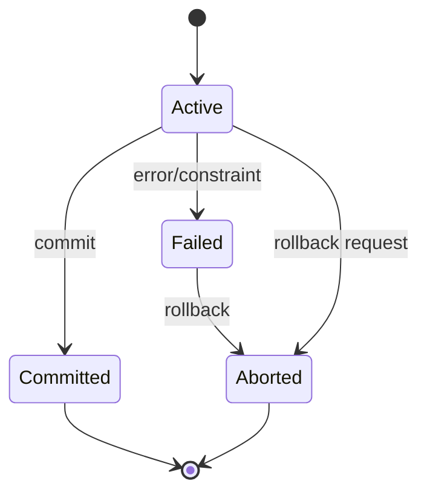

# Lec-12: Transaction

## Quick Highlights
- Transaction = logical unit of work; sequence and grouping matter.
- ACID: Atomicity, Consistency, Isolation, Durability ensure integrity.
- Concurrency control uses schedules (serial, serializable) and isolation levels.
- Abort/commit behaviors define outcome visibility and rollback handling.

## Diagram


## Full Notes
Use the highlights for a quick scan; expand below for the verbatim PDF text.
<details>
<summary>Show raw lecture notes</summary>

```text
1. Transaction definition
  - A transaction is a logical unit of work composed of one or more SQL statements executed as a single unit.
  - Either all statements succeed and their effects persist, or on failure the effects are rolled back.

2. ACID properties
  - Atomicity: all-or-nothing execution — either every operation in a transaction is applied, or none are.
  - Consistency: the database moves from one valid state to another; integrity constraints must hold before and after.
  - Isolation: concurrent transactions behave as if executed serially (each transaction is unaware of others' intermediate states).
  - Durability: once a transaction commits, its changes survive subsequent failures (persisted to stable storage).

3. Transaction states (lifecycle)
  - Active: transaction starts and executes reads/writes.
  - Partially committed: after successful execution but before changes become permanent (often buffered).
  - Committed: changes are made durable; cannot be rolled back.
  - Failed: an error occurred preventing successful completion.
  - Aborted: after rollback, the transaction ends and prior state is restored.
  - Terminated: transaction has either committed or aborted.

4. Concurrency and isolation
  - Schedules: serial, serializable — serializable schedules preserve correctness under concurrency.
  - Isolation levels (e.g., Read Uncommitted, Read Committed, Repeatable Read, Serializable) trade performance for stronger guarantees.

5. Practical notes
  - Use explicit transaction boundaries (START TRANSACTION / COMMIT / ROLLBACK) or connection autocommit controls.
  - Employ appropriate isolation level for the workload and use locks or optimistic concurrency control where needed.
```

</details>

## Interview Q&A
- **Q:** Define ACID with a concrete scenario.
  **A:** Atomicity (all-or-nothing transfer), Consistency (constraints hold), Isolation (concurrent transfers don't interfere), Durability (committed transfer survives crash).
- **Q:** Which isolation level prevents phantom reads?
  **A:** Serializable prevents phantoms; Repeatable Read may still allow them unless using predicate locking or index range locks (varies by DB).
- **Q:** How do you group SQL statements into a transaction in application code?
  **A:** Begin/commit boundaries (START TRANSACTION ... COMMIT) or session autocommit off, with explicit rollback on failures.
