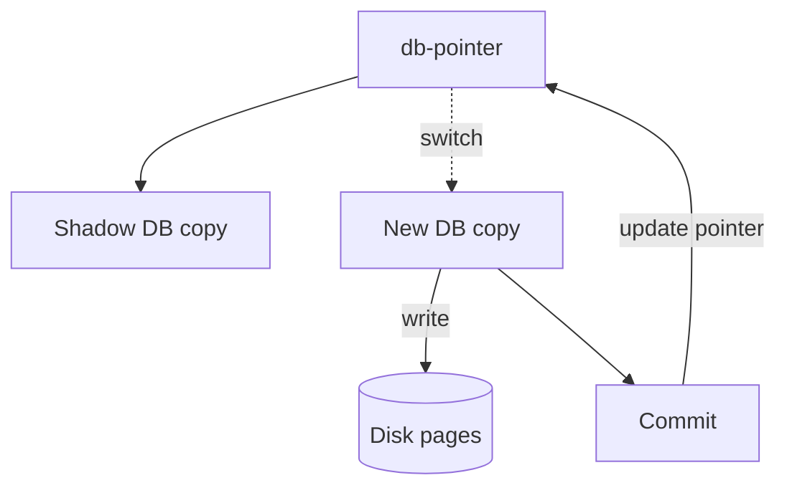

# Lec-13: How to implement Atomicity and Durability in Transactions

## Quick Highlights
- Recovery mechanisms enforce atomicity/durability after crashes.
- Shadow-copy: work on a copy, flip db-pointer on commit; simple, low concurrency.
- Log-based recovery (WAL) tracks updates to enable undo/redo; checkpoints trim logs.
- Force vs non-force, steal vs no-steal buffer policies shape needed recovery actions.

## Diagram


## Full Notes
Use the highlights for a quick scan; expand below for the verbatim PDF text.
<details>
<summary>Show raw lecture notes</summary>

```text
1. Recovery overview
  - Recovery mechanisms ensure atomicity and durability across failures by using techniques like shadow paging and log-based recovery.

2. Shadow-copy (shadow paging)
  - Make a full copy of the database (a new working copy) for updates; maintain a persistent `db-pointer` that points to the current copy.
  - Updates are applied to the new copy; if the transaction aborts, discard the new copy and the old copy remains unchanged.
  - On commit: flush the new copy to disk and atomically update the `db-pointer` to the new copy; the pointer update is the commit point.
  - Pros: simple atomic commit; Cons: full-copy overhead and poor concurrency (best for single-writer or small DBs).

3. Log-based recovery (write-ahead logging)
  - Maintain a durable log of update records (old and new values) on stable storage before applying changes to the database.
  - Two common policies:
    - Deferred updates: record updates in the log, defer writing data pages until commit; if commit not reached, ignore log entries.
    - Immediate updates: write data pages before commit but record enough information in the log so undo is possible for uncommitted changes.
  - On crash recovery, use the log to undo uncommitted transactions and redo committed transactions as needed.

4. Key concepts and policies
  - Write-ahead logging (WAL): log records must be written to stable storage before corresponding DB pages are written.
  - Checkpoints: periodically flush state and record a checkpoint to limit recovery time.
  - Buffer policies: "force" vs "no-force" (whether to write dirty pages at commit) and "steal" vs "no-steal" (whether the buffer manager may write uncommitted pages to disk) determine which undo/redo actions are required.

5. Failure handling summary
  - If a transaction had not committed when a crash occurred, use log's old values to undo its effects.
  - For committed transactions whose changes may not be fully reflected on disk, use log's new values to redo them.

6. Practical notes
  - WAL + careful buffer management provides good concurrency and efficient recovery in production DBMS.
  - Shadow paging is conceptually simpler but less suitable for high-concurrency systems.
```

</details>

## Interview Q&A
- **Q:** Contrast write-ahead logging with shadow paging.
  **A:** WAL appends log records before data writes, supporting concurrency; shadow paging copies pages and flips pointers, simpler but less concurrent and copy-heavy.
- **Q:** What does 'force' vs 'steal' buffer policy mean?
  **A:** Force writes dirty pages at commit; steal allows flushing uncommitted pages. Steal/no-force is common and requires UNDO/REDO logging.
- **Q:** How would you test crash recovery?
  **A:** Simulate crashes mid-transaction, restart the DB, and verify committed data persists while uncommitted changes roll back according to the log.
