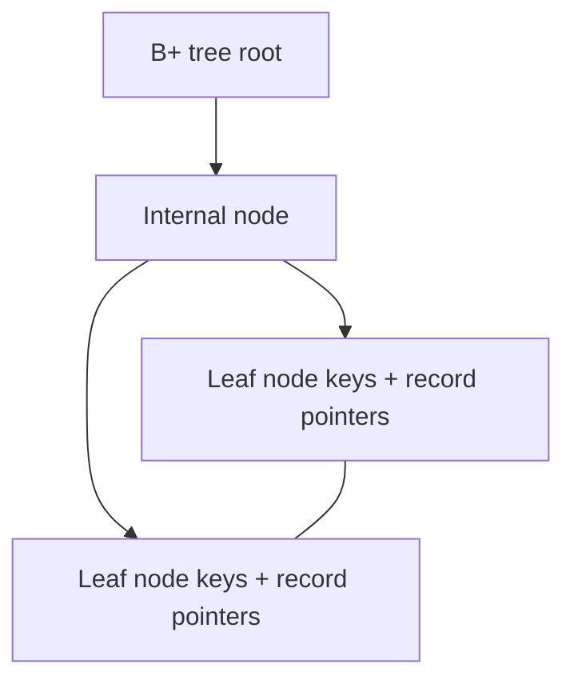

# Lec-14: Indexing in DBMS

## Quick Highlights
- Indexing is a secondary access path to cut disk I/O for lookups and range scans.
- Key + data reference; index files sorted; optional but speeds reads.
- Primary/clustered vs secondary/non-clustered; dense vs sparse; multilevel indexes.
- B+ tree and hash indexing trade-offs; covering indexes avoid base-table hits.

## Diagram


## Full Notes
Use the highlights for a quick scan; expand below for the verbatim PDF text.
<details>
<summary>Show raw lecture notes</summary>

```text
1. What is indexing?
  - An index is a secondary data structure that provides a fast access path to table rows, reducing disk I/O for lookups and range scans.

2. Components
  - Search key: the indexed attribute(s) (often PK or a candidate key).
  - Data reference: a pointer to the data record or block where the corresponding row(s) reside.

3. Index types and properties
  - Index files are typically sorted on the search key.
  - Indexing is optional but improves read performance at the cost of extra storage and slower writes.

4. Dense vs sparse indices
  - Dense index: one index entry per search-key value (or per record); more space, direct mapping.
  - Sparse index: entries exist for some search keys (e.g., one per block); smaller index, requires block-level search.

5. Primary (clustering) index
  - If the data file is physically ordered on a search key, a primary (clustering) index uses that order.
  - Note: "primary index" can also be used informally to mean an index on the primary key; prefer the term "clustering index" for the physical order meaning.

6. Secondary (non-clustering) index
  - Built on an unordered data file; maps key values to record locations and is typically dense (one entry per record).

7. Multi-level indexes
  - Break a large index into multiple levels (index of an index) to keep search cost low; B+ trees are a practical multilevel structure.

8. Common implementations
  - B+ tree: supports ordered scans, range queries, and efficient inserts/ deletes.
  - Hash index: excellent for equality lookups, poor for range queries.

9. Advantages and trade-offs
  - Pros: faster retrieval, fewer I/Os, can support covering queries if index contains required columns.
  - Cons: additional storage, slower INSERT/UPDATE/DELETE due to index maintenance.
```

</details>

## Interview Q&A
- **Q:** Clustered vs non-clustered index?
  **A:** Clustered index orders the table data physically; non-clustered stores separate index pages pointing to data. Most engines allow one clustered index.
- **Q:** Hash vs B+ tree index trade-offs?
  **A:** Hash excels at equality lookups but not range scans/orderings; B+ tree supports range queries, ordering, and partial matches.
- **Q:** What is a covering index?
  **A:** An index that contains all columns needed for a query (key + included columns), allowing index-only scans without touching the base table.
