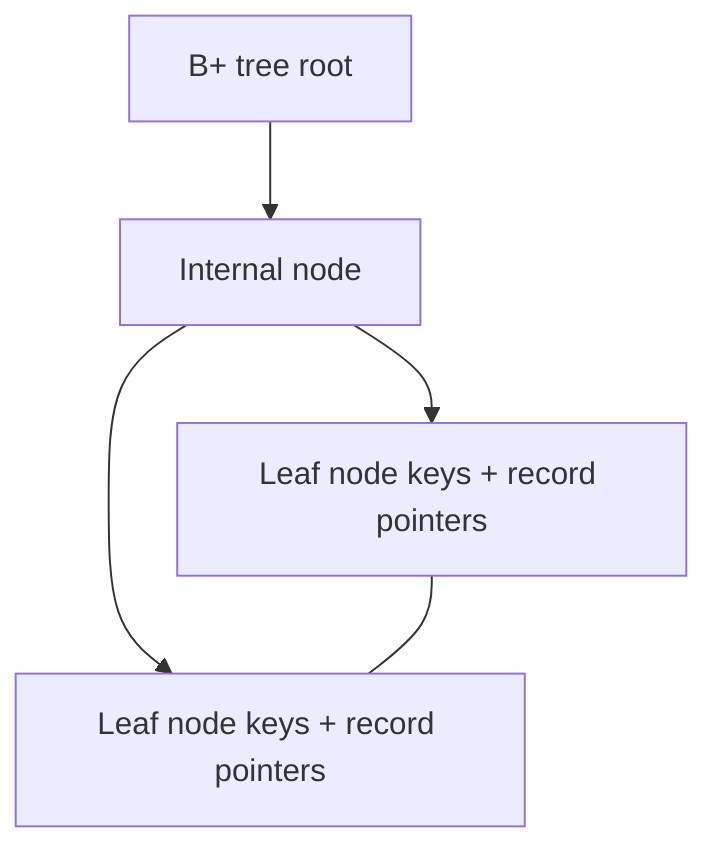

# Lec-14: Indexing in DBMS

## Quick Highlights
- Indexing is a secondary access path to cut disk I/O for lookups and range scans.
- Key + data reference; index files sorted; optional but speeds reads.
- Primary/clustered vs secondary/non-clustered; dense vs sparse; multilevel indexes.
- B+ tree and hash indexing trade-offs; covering indexes avoid base-table hits.

## Diagram


## Full Notes
Use the highlights for a quick scan; expand below for the verbatim PDF text.
<details>
<summary>Show raw lecture notes</summary>

```text
1. Indexing is used to optimise the performance of a database by minimising the number of disk accesses required when a query is
processed.
2. The index is a type of data structure. It is used to locate and access the data in a database table quickly.
3. Speeds up operation with read operations like SELECT queries, WHERE clause etc.
4. Search Key: Contains copy of primary key or candidate key
of the table or something else.
5. Data Reference: Pointer holding the address of disk block
where the value of the corresponding key is stored.
6. Indexing is optional, but increases access speed. It is not the
primary mean to access the tuple, it is the secondary mean.
7. Index file is always sorted.
8. Indexing Methods
1. Primary Index (Clustering Index)
1. A file may have several indices, on dierent search keys. If the data file containing the records is sequentially ordered, a
Primary index is an index whose search key also de fines the sequential order of the file.
2. NOTE: The term primary index is sometimes used to mean an index on a primary key. However, such usage is
nonstandard and should be avoided.
3. All files are ordered sequentially on some search key. It could be Primary Key or non-primary key.
4. Dense And Sparse Indices
1. Dense Index
1. The dense index contains an index record for every search key value in the data file.
2. The index record contains the search-key value and a pointer to the first data record with that search-key value.
The rest of the records with the same search-key value would be stored sequentially after the first record.
3. It needs more space to store index record itself. The index records have the search key and a pointer to the actual
record on the disk.
2. Sparse Index
1. An index record appears for only some of the search-key values.
2. Sparse Index helps you to resolve the issues of dense Indexing in DBMS. In this method of indexing technique, a
range of index columns stores the same data block address, and when data needs to be retrieved, the block
address will be fetched.
5. Primary Indexing can be based on Data file is sorted w.r.t Primary Key a ttribute or non-key attributes.
6. Based on Key attribute
1. Data file is sorted w.r.t primary key attribute.
2. PK will be used as search-key in Index.
3. Sparse Index will be formed i.e., no. of entries in the index file = no. of blocks in datafile.
7. Based on Non-Key attribute
1. Data file is sorted w.r.t non-key attribute.
2. No. Of entries in the index  = unique non-key attribute value in the data file.
3. This is dense index as, all the unique values have an entry in the
index file.
4. E.g., Lets assume that a company recruited many employees in
various departments. In this case, clustering indexing in DBMS
should be created for all employees who belong to the same
dept.
8. Multi-level Index
1. Index with two or more levels.
2. If the single level index become enough large that the binary
search it self would take much time, we can break down
indexing into multiple levels.
2. Secondary Index (Non-Clustering Index)
1. Datafile is unsorted. Hence, Primary Indexing is not possible.
2. Can be done on key or non-key attribute.
3. Called secondary indexing because normally one indexing is already
applied.
4. No. Of entries in the index file = no. of records in the data file.
5. It's an example of Dense index.
9. Advantages of Indexing
1. Faster access and retrieval of data.
2. IO is less.
10. Limitations of Indexing
1. Additional space to store index table
2. Indexing Decrease performance in INSERT, DELETE, and UPDATE query.
```

</details>

## Interview Q&A
- **Q:** Clustered vs non-clustered index?
  **A:** Clustered index orders the table data physically; non-clustered stores separate index pages pointing to data. Most engines allow one clustered index.
- **Q:** Hash vs B+ tree index trade-offs?
  **A:** Hash excels at equality lookups but not range scans/orderings; B+ tree supports range queries, ordering, and partial matches.
- **Q:** What is a covering index?
  **A:** An index that contains all columns needed for a query (key + included columns), allowing index-only scans without touching the base table.
