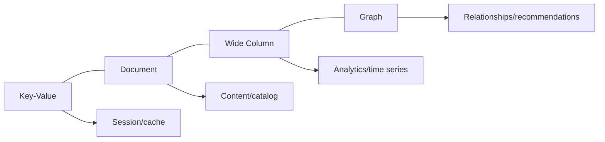

# Lec-15: NoSQL

## Quick Highlights
- NoSQL = "not only SQL"; non-tabular models: document, key-value, wide-column, graph.
- Flexible schemas, horizontal scaling, and handling of big/varied data.
- Eventual consistency and CAP trade-offs common in distributed NoSQL stores.
- Use cases: caching, content/catalog, analytics/time-series, relationship-heavy workloads.

## Diagram


## Full Notes
Use the highlights for a quick scan; expand below for the verbatim PDF text.
<details>
<summary>Show raw lecture notes</summary>

```text
```

</details>

## Interview Q&A
- **Q:** When would you pick a document DB over relational?
  **A:** When schemas are dynamic, data is hierarchical, and you want to avoid expensive joins—e.g., product catalogs or content metadata.
- **Q:** Explain eventual consistency in NoSQL stores.
  **A:** Writes propagate asynchronously; replicas converge over time. Clients may read stale data unless using stronger consistency options.
- **Q:** How do key design and partitioning interact in NoSQL?
  **A:** A good partition/shard key evenly distributes load while preserving query patterns (avoid hot partitions; sometimes add random suffixes or time bucketing).
