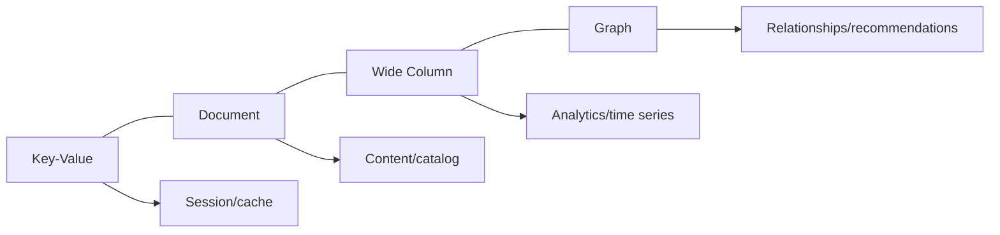

# Lec-15: NoSQL

## Quick Highlights
- NoSQL = "not only SQL"; non-tabular models: document, key-value, wide-column, graph.
- Flexible schemas, horizontal scaling, and handling of big/varied data.
- Eventual consistency and CAP trade-offs common in distributed NoSQL stores.
- Use cases: caching, content/catalog, analytics/time-series, relationship-heavy workloads.

## Diagram


## Full Notes
Use the highlights for a quick scan; expand below for the verbatim PDF text.
<details>
<summary>Show raw lecture notes</summary>

```text
1. NoSQL databases (aka "not only SQL") are non-tabular databases and store data di erently than relational tables. NoSQL databases
come in a variety of types based on their data model. The main types are document, key-value, wide-column, and graph. They
provide flexible schemas and scale easily with large amounts of data and high user loads.
1. They are schema free.
2. Data structures used are not tabular, they are more flexible, has the ability to adjust dynamically.
3. Can handle huge amount of data (big data).
4. Most of the NoSQL are open sources and has the capability of horizontal scaling.
5. It just stores data in some format other than relational.
2. History behind NoSQL
1. NoSQL databases emerged in the late 2000s as the cost of storage dramatically decreased. Gone were the days of needing to
create a complex, di cult-to-manage data model in order to avoid data duplication. Developers (rather than storage) were
becoming the primary cost of software development, so NoSQL databases optimised for developer productivity.
2. Data becoming unstructured more, hence structuring (defining schema in advance) them had becoming costly.
3. NoSQL databases allow developers to store huge amounts of unstructured data, giving them a lot of flexibility.
4. Recognising the need to rapidly adapt to changing requirements in a so ftware system. Developers needed the ability to iterate
quickly and make changes throughout their so ftware stack  all the way down to the database. NoSQL databases gave them
this flexibility.
5. Cloud computing also rose in popularity, and developers began using public clouds to host their applications and data. They
wanted the ability to distribute data across multiple servers and regions to make their applications resilient, to scale out instead
of scale up, and to intelligently geo-place their data. Some NoSQL databases like MongoDB provide these capabilities.
3. NoSQL Databases Advantages
A. Flexible Schema
1. RDBMS has pre-de fined schema, which become an issue when we do not have all the data with us or we need to change
the schema. It's a huge task to change schema on the go.
B. Horizontal Scaling
1. Horizontal scaling, also known as scale-out, refers to bringing on additional nodes to share the load. This is di cult with
relational databases due to the di culty in spreading out related data across nodes. With non-relational databases, this is
made simpler since collections are self-contained and not coupled relationally. This allows them to be distributed across
nodes more simply, as queries do not have to join them together across nodes.
2. Scaling horizontally is achieved through Sharding OR Replica-sets.
C. High Availability
1. NoSQL databases are highly available due to its auto replication feature i.e. whenever any kind of failure happens data
replicates itself to the preceding consistent state.
2. If a server fails, we can access that data from another server as well, as in NoSQL database data is stored at multiple
servers.
D. Easy insert and read operations.
1. Queries in NoSQL databases can be faster than SQL databases. Why? Data in SQL databases is typically normalised, so
queries for a single object or entity require you to join data from multiple tables. As your tables grow in size, the joins can
become expensive. However, data in NoSQL databases is typically stored in a way that is optimised for queries. The rule of
thumb when you use MongoDB is data that is accessed together should be stored together. Queries typically do not require
joins, so the queries are very fast.
2. But dicult delete or update operations.
E. Caching mechanism.
F. NoSQL use case is more for Cloud applications.
4. When to use NoSQL?
1. Fast-paced Agile development
2. Storage of structured and semi-structured data
3. Huge volumes of data
4. Requirements for scale-out architecture
5. Modern application paradigms like micro-services and real-time streaming.
5. NoSQL DB Misconceptions
1. Relationship data is best suited for relational databases.
1. A common misconception is that NoSQL databases or non-relational databases dont store relationship data well. NoSQL
databases can store relationship data  they just store it di erently than relational databases do. In fact, when compared
with relational databases, many find modelling relationship data in NoSQL databases to be easier than in relational
databases, because related data doesnt have to be split between tables. NoSQL data models allow related data to be
nested within a single data structure.
2. NoSQL databases don't support ACID transactions.
1. Another common misconception is that NoSQL databases don't support ACID transactions. Some NoSQL databases like
MongoDB do, in fact, support ACID transactions.
6. Types of NoSQL Data Models
1. Key-Value Stores
1. The simplest type of NoSQL database is a key-value store. Every data element in the database is stored as a key value pair
consisting of an a ttribute name (or "key") and a value. In a sense, a key-value store is like a relational database with only
two columns: the key or attribute name (such as "state") and the value (such as "Alaska").
2. Use cases include shopping carts, user preferences, and user pro files.
3. e.g., Oracle NoSQL, Amazon DynamoDB, MongoDB also supports Key-Value store, Redis.
4. A key-value database associates a value (which can be anything from a number or simple string to a complex object) with
a key, which is used to keep track of the object. In its simplest form, a key-value store is like a dictionary/array/map object
as it exists in most programming paradigms, but which is stored in a persistent way and managed by a Database
Management System (DBMS).
5. Key-value databases use compact, e cient index structures to be able to quickly and reliably locate a value by its key,
making them ideal for systems that need to be able to find and retrieve data in constant time.
6. There are several use-cases where choosing a key value store approach is an optimal solution:
a) Real time random data access, e.g., user session a ttributes in an online application such as gaming or finance.
b) Caching mechanism for frequently accessed data or configuration based on keys.
c) Application is designed on simple key-based queries.
2. Column-Oriented / Columnar / C-Store / Wide-Column
1. The data is stored such that each row of a column will be next to other rows from that same column.
2. While a relational database stores data in rows and reads data row by row, a column store is organised as a set of columns.
This means that when you want to run analytics on a small number of columns, you can read those columns directly
without consuming memory with the unwanted data. Columns are o ften of the same type and bene fit from more e cient
compression, making reads even faster. Columnar databases can quickly aggregate the value of a given column (adding up
the total sales for the year, for example). Use cases include analytics.
3. e.g., Cassandra, RedShi ft, Snowflake.
3. Document Based Stores
1. This DB store data in documents similar to JSON (JavaScript Object Notation) objects. Each document contains pairs of
fields and values. The values can typically be a variety of types including things like strings, numbers, booleans, arrays, or
objects.
2. Use cases include e-commerce platforms, trading platforms, and mobile app development across industries.
3. Supports ACID properties hence, suitable for Transactions.
4. e.g., MongoDB, CouchDB.
4. Graph Based Stores
1. A graph database focuses on the relationship between data elements. Each element is stored as a node (such as a person
in a social media graph). The connections between elements are called links or relationships. In a graph database,
connections are first-class elements of the database, stored directly. In relational databases, links are implied, using data to
express the relationships.
2. A graph database is optimised to capture and search the connections between data elements, overcoming the overhead
associated with JOINing multiple tables in SQL.
3. Very few real-world business systems can survive solely on graph queries. As a result graph databases are usually run
alongside other more traditional databases.
4. Use cases include fraud detection, social networks, and knowledge graphs.
7. NoSQL Databases Dis-advantages
1. Data Redundancy
1. Since data models in NoSQL databases are typically optimised for queries and not for reducing data duplication, NoSQL
databases can be larger than SQL databases. Storage is currently so cheap that most consider this a minor drawback, and
some NoSQL databases also support compression to reduce the storage footprint.
2. Update & Delete operations are costly.
3. All type of NoSQL Data model doesnt fulfil all of your application needs
1. Depending on the NoSQL database type you select, you may not be able to achieve all of your use cases in a single
database. For example, graph databases are excellent for analysing relationships in your data but may not provide what
you need for everyday retrieval of the data such as range queries. When selecting a NoSQL database, consider what your
use cases will be and if a general purpose database like MongoDB would be a be tter option.
4. Doesnt support ACID properties in general.
5. Doesnt support data entry with consistency constraints.
8. SQL vs NoSQL
SQL Databases NoSQL Databases
Data Storage Model Tables with xed rows and
columns
Document: JSON documents,
Key-value: key-value pairs, Wide-
column: tables with rows and
dynamic columns, Graph: nodes
and edges
Development History Developed in the 1970s with a
focus on reducing data
duplication
Developed in the late 2000s with
a focus on scaling and allowing
for rapid application change
driven by agile and DevOps
practices.
Examples Oracle, MySQL, Microsoft SQL
Server, and PostgreSQL
Document: MongoDB and
CouchDB, Key-value: Redis and
DynamoDB, Wide-column:
Cassandra and HBase, Graph:
Neo4j and Amazon Neptune
Primary Purpose General Purpose Document: general purpose, Key-
value: large amounts of data with
simple lookup queries, Wide-
column: large amounts of data
with predictable query patterns,
Graph: analyzing and traversing
relationships between connected
data
Schemas Fixed Flexible
Scaling Vertical (Scale-up) Horizontal (scale-out across
commodity servers)
ACID Properties Supported Not Supported, except in DB like
MongoDB etc.
JOINS Typically Required Typically not required
Data to object mapping Required object-relational
mapping
Many do not require ORMs.
MongoDB documents map
directly to data structures in most
popular programming languages.
```

</details>

## Interview Q&A
- **Q:** When would you pick a document DB over relational?
  **A:** When schemas are dynamic, data is hierarchical, and you want to avoid expensive joins—e.g., product catalogs or content metadata.
- **Q:** Explain eventual consistency in NoSQL stores.
  **A:** Writes propagate asynchronously; replicas converge over time. Clients may read stale data unless using stronger consistency options.
- **Q:** How do key design and partitioning interact in NoSQL?
  **A:** A good partition/shard key evenly distributes load while preserving query patterns (avoid hot partitions; sometimes add random suffixes or time bucketing).
