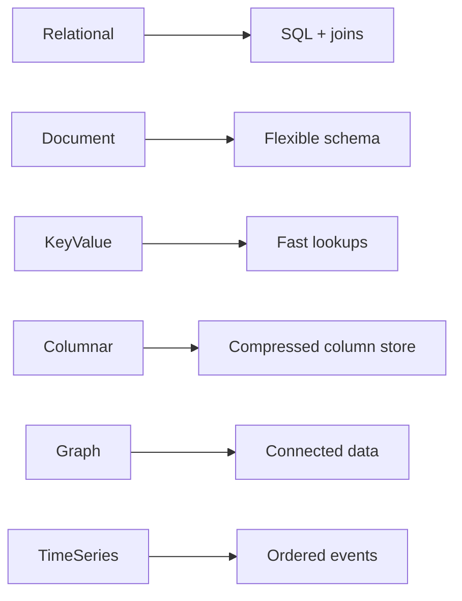

# Lec-16: Types of Databases

## Quick Highlights
- Database categories: relational, document, key-value, graph, columnar, time-series, cloud/analytic.
- Relational uses SQL and joins; document stores JSON-like flexible docs.
- Key-value excels at simple lookups/caching; graph optimizes traversals.
- Columnar and time-series optimize analytics/ordered events; cloud DBs handle scaling/ops.

## Diagram


## Full Notes
Use the highlights for a quick scan; expand below for the verbatim PDF text.
<details>
<summary>Show raw lecture notes</summary>

```text
1. Relational Databases
1. Based on Relational Model.
2. Relational databases are quite popular, even though it was a system designed in the 1970s. Also known as relational database
management systems (RDBMS), relational databases commonly use Structured Query Language (SQL) for operations such as
creating, reading, updating, and deleting data. Relational databases store information in discrete tables, which can be JOINed
together by fields known as foreign keys. For example, you might have a User table which contains information about all your
users, and join it to a Purchases table, which contains information about all the purchases theyve made. MySQL, Microso ft SQL
Server, and Oracle are types of relational databases.
3. they are ubiquitous, having acquired a steady user base since the 1970s
4. they are highly optimised for working with structured data.
5. they provide a stronger guarantee of data normalisation
6. they use a well-known querying language through SQL
7. Scalability issues (Horizontal Scaling).
8. Data become huge, system become more complex.
2. Object Oriented Databases
1. Relational databases
  - Based on the relational model and widely used for structured data. Use SQL for schema definition and queries. Tables are joined via foreign keys. Examples: MySQL, PostgreSQL, Oracle.
  - Strengths: mature tooling, strong consistency, normalized schemas, well-known query language.
  - Limitations: horizontal scaling and sharding can be complex for tightly related data.

2. Object-oriented databases
  - Store objects (with identity, inheritance, encapsulation) much like object-oriented programming languages do.
  - Good for complex data models and advanced types; can be more natural when application code uses objects heavily.
  - Trade-offs: less widespread adoption, potential performance and tooling limitations. Examples: ObjectDB, GemStone.

3. NoSQL databases (see Lec-15)
  - Non-tabular models: key-value, document, wide-column, and graph. Offer flexible schemas, horizontal scaling, and are suited for large or rapidly changing datasets.

4. Hierarchical databases
  - Tree-structured model (one-to-many parent-child). Fast traversal for hierarchical data but inflexible for many-to-many relationships. Example: IBM IMS.

5. Network databases
  - Generalize hierarchical models to allow records to have multiple parents (graph-like structure). Can model complex relationships but are harder to maintain and query. Examples: IDMS, Raima.

6. Other categories (brief)
  - Columnar/wide-column stores: optimized for analytics and aggregation (e.g., Cassandra, Redshift, Snowflake).
  - Time-series databases: optimized for append-heavy, time-ordered metrics and retention policies.
  - Cloud-native and managed databases: focus on scalability, operational simplicity, and geo-distribution.

7. Choosing the right DB
  - Match data model and query patterns: OLTP vs OLAP, graph traversals, document retrieval, or simple key lookups.
  - Consider scalability, consistency, operational costs, and ecosystem/tooling.
5. Most of the NoSQL are open sources and has the capability of horizontal scaling.
