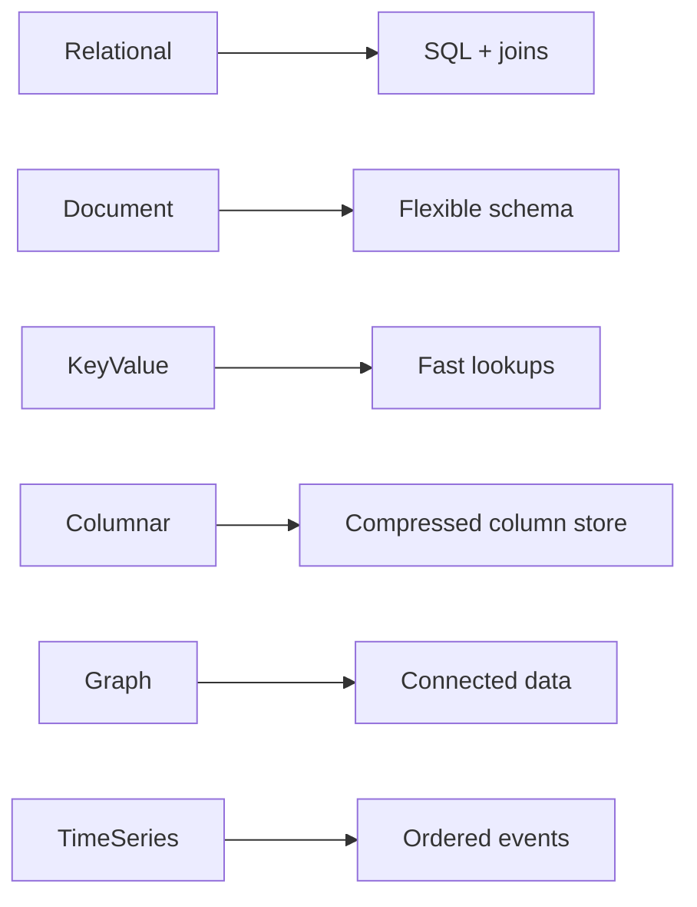

# Lec-16: Types of Databases

## Quick Highlights
- Database categories: relational, document, key-value, graph, columnar, time-series, cloud/analytic.
- Relational uses SQL and joins; document stores JSON-like flexible docs.
- Key-value excels at simple lookups/caching; graph optimizes traversals.
- Columnar and time-series optimize analytics/ordered events; cloud DBs handle scaling/ops.

## Diagram


## Full Notes
Use the highlights for a quick scan; expand below for the verbatim PDF text.
<details>
<summary>Show raw lecture notes</summary>

```text
1. Relational Databases
1. Based on Relational Model.
2. Relational databases are quite popular, even though it was a system designed in the 1970s. Also known as relational database
management systems (RDBMS), relational databases commonly use Structured Query Language (SQL) for operations such as
creating, reading, updating, and deleting data. Relational databases store information in discrete tables, which can be JOINed
together by fields known as foreign keys. For example, you might have a User table which contains information about all your
users, and join it to a Purchases table, which contains information about all the purchases theyve made. MySQL, Microso ft SQL
Server, and Oracle are types of relational databases.
3. they are ubiquitous, having acquired a steady user base since the 1970s
4. they are highly optimised for working with structured data.
5. they provide a stronger guarantee of data normalisation
6. they use a well-known querying language through SQL
7. Scalability issues (Horizontal Scaling).
8. Data become huge, system become more complex.
2. Object Oriented Databases
1. The object-oriented data model, is based on the object-oriented-programming paradigm, which is now in wide use.
Inheritance, object-identity, and encapsulation (information hiding), with methods to provide an interface to objects, are
among the key concepts of object-oriented programming that have found applications in data modelling. The object-oriented
data model also supports a rich type system, including structured and collection types. While inheritance and, to some extent,
complex types are also present in the E-R model, encapsulation and object-identity distinguish the object-oriented data model
from the E-R model.
2. Sometimes the database can be very complex, having multiple relations. So, maintaining a relationship between them can be
tedious at times.
1. In Object-oriented databases data is treated as an object.
2. All bits of information come in one instantly available object package instead of multiple tables.
3. Advantages
1. Data storage and retrieval is easy and quick.
2. Can handle complex data relations and more variety of data types that standard relational databases.
3. Relatively friendly to model the advance real world problems
4. Works with functionality of OOPs and Object Oriented languages.
4. Disadvantages
1. High complexity causes performance issues like read, write, update and delete operations are slowed down.
2. Not much of a community support as isnt widely adopted as relational databases.
3. Does not support views like relational databases.
5. e.g., ObjectDB, GemStone etc.
3. NoSQL Databases
1. NoSQL databases (aka "not only SQL") are non-tabular databases and store data di erently than relational tables. NoSQL
databases come in a variety of types based on their data model. The main types are document, key-value, wide-column, and
graph. They provide flexible schemas and scale easily with large amounts of data and high user loads.
2. They are schema free.
3. Data structures used are not tabular, they are more flexible, has the ability to adjust dynamically.
4. Can handle huge amount of data (big data).
5. Most of the NoSQL are open sources and has the capability of horizontal scaling.
6. It just stores data in some format other than relational.
7. Refer LEC-15 notes
4. Hierarchical Databases
1. As the name suggests, the hierarchical database model is most appropriate for use cases in which the main focus of information
gathering is based on a concrete hierarchy, such as several individual employees reporting to a single department at a
company.
2. The schema for hierarchical databases is de fined by its tree-like organisation, in which there is typically a root parent
directory of data stored as records that links to various other subdirectory branches, and each subdirectory branch, or child
record, may link to various other subdirectory branches.
3. The hierarchical database structure dictates that, while a parent record can have several child records, each child record can only
have one parent record. Data within records is stored in the form of fields, and each field can only contain one value. Retrieving
hierarchical data from a hierarchical database architecture requires traversing the entire tree, starting at the root node.
4. Since the disk storage system is also inherently a hierarchical structure, these models can also be used as physical models.
5. The key advantage of a hierarchical database is its ease of use. The one-to-many organisation of data makes traversing the
database simple and fast, which is ideal for use cases such as website drop-down menus or computer folders in systems like
Microsoft Windows OS. Due to the separation of the tables from physical storage structures, information can easily be added or
deleted without a ecting the entirety of the database. And most major programming languages o er functionality for reading
tree structure databases.
6. The major disadvantage of hierarchical databases is their inflexible nature. The one-to-many structure is not ideal for complex
structures as it cannot describe relationships in which each child node has multiple parents nodes. Also the tree-like
organisation of data requires top-to-bo ttom sequential searching, which is time consuming, and requires repetitive storage of
data in multiple dierent entities, which can be redundant.
7. e.g., IBM IMS.
5. Network Databases
1. Extension of Hierarchical databases
2. The child records are given the freedom to associate with multiple parent records.
3. Organised in a Graph structure.
4. Can handle complex relations.
5. Maintenance is tedious.
6. M:N links may cause slow retrieval.
7. Not much web community support.
8. e.g., Integrated Data Store (IDS), IDMS (Integrated Database Management System),
Raima Database Manager, TurboIMAGE etc.
```

</details>

## Interview Q&A
- **Q:** Why are columnar stores faster for analytics?
  **A:** They read only needed columns, compress well, and support vectorized scans; row stores are better for OLTP writes and point lookups.
- **Q:** Give a use case for graph databases.
  **A:** Fraud detection or recommendations where traversing multi-hop relationships efficiently is key.
- **Q:** How do time-series databases optimize for append-heavy workloads?
  **A:** They use time-ordered partitions, compression, and downsampling/retention policies tuned for sequential writes and range queries.
