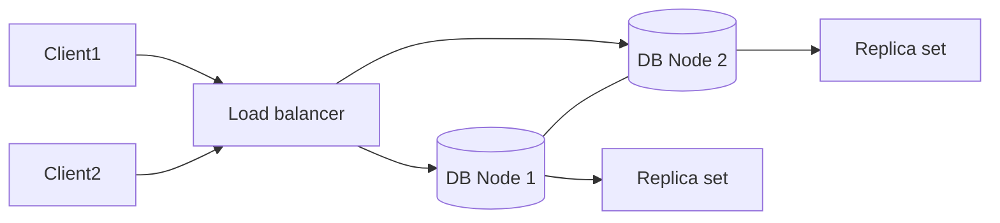

# Lec-17: Clustering in DBMS

## Quick Highlights
- Clustering = multiple servers sharing replicated data for availability and scale.
- Replica sets improve redundancy; load balancers route requests across nodes.
- Failover and replication lag are key operational concerns.
- Security and consistency considerations increase with more nodes.

## Diagram


## Full Notes
Use the highlights for a quick scan; expand below for the verbatim PDF text.
<details>
<summary>Show raw lecture notes</summary>

```text
1. What is database clustering?
  - Clustering groups multiple database servers (nodes) to provide redundancy, scale, and high availability for the same dataset.

2. Replication models
  - Synchronous replication: replicas apply updates before commit (stronger guarantees, higher latency).
  - Asynchronous replication: replicas apply updates later (lower write latency, possible replication lag and stale reads).

3. Benefits of clustering
  - Redundancy: multiple copies of the data reduce single-point-of-failure risk.
  - Load balancing: distribute client requests across nodes to increase throughput and handle traffic spikes.
  - High availability: failover and replica promotion help keep the service online during node failures.

4. Operational concerns
  - Replication lag: delay between primary and replicas may cause stale reads; choose consistency model accordingly.
  - Failover and split-brain: use quorum/election protocols and fencing to avoid conflicting primaries.
  - Consistency vs availability trade-offs depend on replication mode and network partitions.

5. How clustering works (high-level)
  - Nodes share replicated data; a load balancer or proxy routes requests. If one node fails, the system routes traffic to healthy nodes and can promote replicas when needed.
```

</details>

## Interview Q&A
- **Q:** How does replication improve availability?
  **A:** Multiple copies allow failover when one node dies, maintaining reads; synchronous vs asynchronous replication trades latency vs durability.
- **Q:** What is replication lag and why does it matter?
  **A:** Delay between master and replicas applying changes; it can cause stale reads or inconsistency in read-after-write workloads.
- **Q:** How would you avoid split-brain in a DB cluster?
  **A:** Use consensus/quorum protocols, fencing, or managed failover with single writer election to ensure only one primary at a time.
