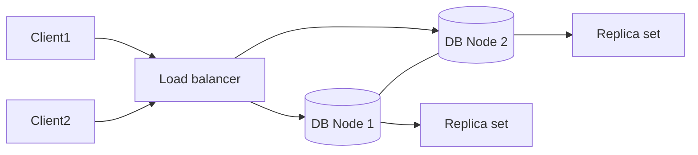

# Lec-17: Clustering in DBMS

## Quick Highlights
- Clustering = multiple servers sharing replicated data for availability and scale.
- Replica sets improve redundancy; load balancers route requests across nodes.
- Failover and replication lag are key operational concerns.
- Security and consistency considerations increase with more nodes.

## Diagram


## Full Notes
Use the highlights for a quick scan; expand below for the verbatim PDF text.
<details>
<summary>Show raw lecture notes</summary>

```text
1. Database Clustering (making Replica-sets) is the process of combining more than one servers or instances connecting a single database.
Sometimes one server may not be adequate to manage the amount of data or the number of requests, that is when a Data Cluster is needed.
Database clustering, SQL server clustering, and SQL clustering are closely associated with SQL is the language used to manage the database
information.
2. Replicate the same dataset on different servers.
3. Advantages
1. Data Redundancy: Clustering of databases helps with data redundancy, as we store the same data at multiple servers. Dont confuse this
data redundancy as repetition of the same data that might lead to some anomalies. The redundancy that clustering offers is required and is
quite certain due to the synchronisation. In case any of the servers had to face a failure due to any possible reason, the data is available at other
servers to access.
2. Load balancing: or scalability doesnt come by default with the database. It has to be brought by clustering regularly. It also depends on the
setup. Basically, what load balancing does is allocating the workload among the different servers that are part of the cluster. This indicates that
more users can be supported and if for some reasons if a huge spike in the traf c appears, there is a higher assurance that it will be able to
support the new trafc. One machine is not going to get all of the hits. This can provide scaling seamlessly as required. This links directly to
high availability. Without load balancing, a particular machine could get overworked and traf c would slow down, leading to decrement of
the trafc to zero.
3. High availability: When you can access a database, it implies that it is available. High availability refers the amount of time a database is
considered available. The amount of availability you need greatly depends on the number of transactions you are running on your database
and how often you are running any kind of analytics on your data. With database clustering, we can reach extremely high levels of availability
due to load balancing and have extra machines. In case a server got shut down the database will, however, be available.
4. How does Clustering Work?
1. In cluster architecture, all requests are split with many computers so that an individual user request is executed and produced by a number of
computer systems. The clustering is serviceable denitely by the ability of load balancing and high-availability. If one node collapses, the
request is handled by another node. Consequently, there are few or no possibilities of absolute system failures.
```

</details>

## Interview Q&A
- **Q:** How does replication improve availability?
  **A:** Multiple copies allow failover when one node dies, maintaining reads; synchronous vs asynchronous replication trades latency vs durability.
- **Q:** What is replication lag and why does it matter?
  **A:** Delay between master and replicas applying changes; it can cause stale reads or inconsistency in read-after-write workloads.
- **Q:** How would you avoid split-brain in a DB cluster?
  **A:** Use consensus/quorum protocols, fencing, or managed failover with single writer election to ensure only one primary at a time.
