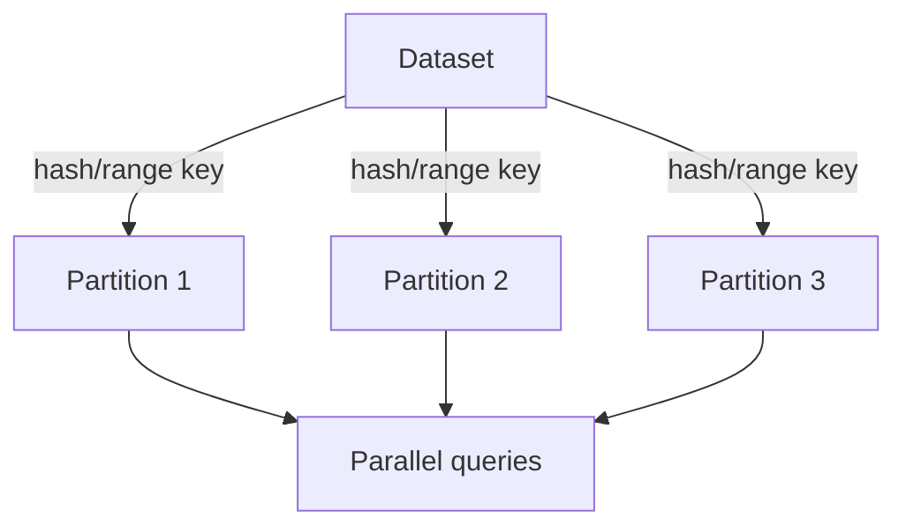

# Lec-18: Partitioning & Sharding in DBMS (DB Optimisation)

## Quick Highlights
- Partitioning/sharding splits large datasets into manageable slices across servers.
- Horizontal vs vertical partitioning; range/hash/list/round-robin strategies.
- Benefits: performance, manageability, parallelism; costs: cross-shard queries, rebalancing.
- Choosing a shard key balances load distribution and query locality.

## Diagram


## Full Notes
Use the highlights for a quick scan; expand below for the verbatim PDF text.
<details>
<summary>Show raw lecture notes</summary>

```text
1. Partitioning overview
  - Partitioning divides large tables into smaller, manageable pieces (partitions) so queries and maintenance operate on smaller subsets.
  - Partitioned tables are transparent to SQL; the optimizer can target the relevant partitions for a query.

2. Partitioning strategies
  - Vertical partitioning: split a table by columns (move less-used or wide columns into a separate structure).
  - Horizontal partitioning: split a table by rows (each partition stores a subset of rows).

3. When to partition
  - Very large datasets where single-server operations become slow.
  - High request volumes that benefit from parallelism across machines.

4. Benefits
  - Parallel query execution, better manageability, improved availability, and cost-effective scaling compared to monolithic scale-up.

5. Distributed databases and sharding
  - A distributed database is a logical database spread across multiple servers; partitioning, clustering, and sharding are used to implement it.
  - Sharding is horizontal partitioning across multiple database instances with a routing layer that forwards queries to the correct shard.

6. Sharding trade-offs
  - Pros: scalability and availability.
  - Cons: added complexity (routing, metadata, resharding), cross-shard queries (scatter-gather), and challenges in rebalancing data.

7. Common shard schemes
  - Range partitioning: contiguous ranges (good for ordered/time-series queries).
  - Hash partitioning: distributes load evenly (good for uniform access patterns).
  - List and round-robin: other simple schemes; composite schemes combine methods for balance and locality.

8. Practical guidance
  - Choose a shard key with high cardinality and that matches common query filters to avoid hotspots and minimize cross-shard joins.
  - Use coordinators, global indexes, or materialized aggregates to handle cross-shard queries when necessary.
```

</details>

## Interview Q&A
- **Q:** Range vs hash partitioning—when to use each?
  **A:** Range suits ordered queries/time-series; hash balances load uniformly for random access. Composite schemes mix both.
- **Q:** How do you choose a good shard key?
  **A:** Pick a high-cardinality field used in filters that avoids hotspots and supports data locality for common queries.
- **Q:** How to run queries that span shards?
  **A:** Use scatter-gather with coordinators, or maintain global indexes/aggregations; design queries to minimize cross-shard joins.
