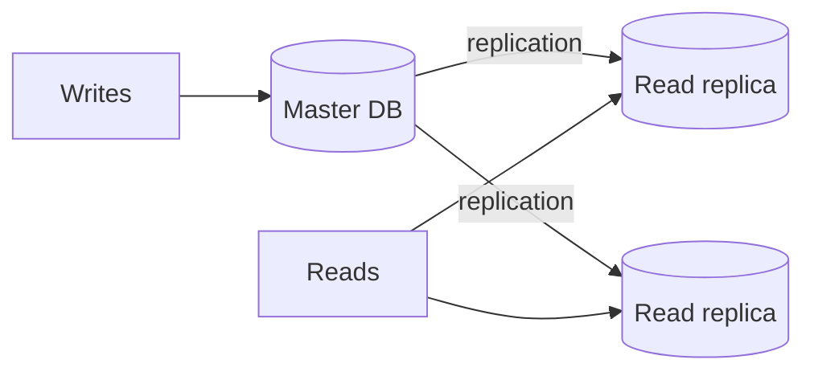

# Lec-21: Master-Slave Database Concept

## Quick Highlights
- Master-slave (primary-replica) splits writes to master, reads to replicas.
- Replication distributes data; replicas reduce read load but can lag.
- Failover requires safe promotion and routing updates.
- Used to improve throughput, availability, and read latency.

## Diagram


## Full Notes
Use the highlights for a quick scan; expand below for the verbatim PDF text.
<details>
<summary>Show raw lecture notes</summary>

```text
1. Master–slave (primary–replica) overview
  - Pattern for scaling read throughput: writes go to the master (primary), reads served by one or more read replicas (slaves).

2. Behavior and trade-offs
  - The master holds the authoritative copy; replicas receive updates via replication (synchronous or asynchronous).
  - Read replicas reduce read latency and improve throughput but may lag behind the master (stale reads).

3. Operational considerations
  - Routing: application or proxy/connection pool must route writes to master and reads to replicas; handle failover and role metadata.
  - Promotion: promoting a replica to master requires ensuring it has all updates (WAL/relay logs), stopping writes to the old master, and rebuilding other replicas as needed.
  - Consistency: choose replication mode and read routing carefully to avoid read-after-write surprises.
```

</details>

## Interview Q&A
- **Q:** How do applications route reads and writes in master-slave setups?
  **A:** Writes go to master; reads go to replicas via connection pools or proxies that understand role metadata, with fallbacks on failover.
- **Q:** What risks come with read replicas?
  **A:** Replica lag causing stale reads, potential inconsistency for read-after-write flows, and added complexity in promotion/failover.
- **Q:** How do you promote a replica to master safely?
  **A:** Ensure it has all WAL/relay logs, stop writes to old master, elect/promote the replica, redirect traffic, and rebuild other replicas from the new master.
