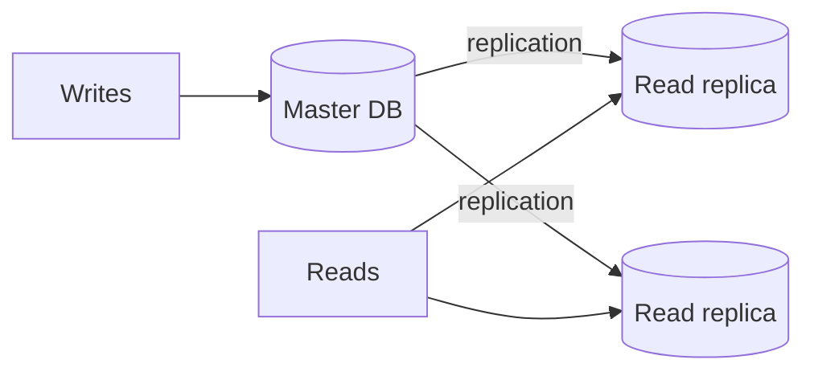

# Lec-21: Master-Slave Database Concept

## Quick Highlights
- Master-slave (primary-replica) splits writes to master, reads to replicas.
- Replication distributes data; replicas reduce read load but can lag.
- Failover requires safe promotion and routing updates.
- Used to improve throughput, availability, and read latency.

## Diagram


## Full Notes
Use the highlights for a quick scan; expand below for the verbatim PDF text.
<details>
<summary>Show raw lecture notes</summary>

```text
1. Master-Slave is a general way to optimise IO in a system where number of requests goes way high that a single DB server is not able to handle it
efciently.
2. Its a Pattern 3 in LEC-19 (Database Scaling Pattern). (Command Query Responsibility Segregation)
3. The true or latest data is kept in the Master DB thus write operations are directed there. Reading ops are done only from slaves. This architecture
serves the purpose of safeguarding site reliability, availability, reduce latency etc . If a site receives a lot of trafc and the only available
database is one master, it will be overloaded with reading and writing requests. Making the entire system slow for everyone on the site.
4. DB replication will take care of distributing data from Master machine to Slaves machines. This can be synchronous or asynchronous depending
upon the systems need.
```

</details>

## Interview Q&A
- **Q:** How do applications route reads and writes in master-slave setups?
  **A:** Writes go to master; reads go to replicas via connection pools or proxies that understand role metadata, with fallbacks on failover.
- **Q:** What risks come with read replicas?
  **A:** Replica lag causing stale reads, potential inconsistency for read-after-write flows, and added complexity in promotion/failover.
- **Q:** How do you promote a replica to master safely?
  **A:** Ensure it has all WAL/relay logs, stop writes to old master, elect/promote the replica, redirect traffic, and rebuild other replicas from the new master.
